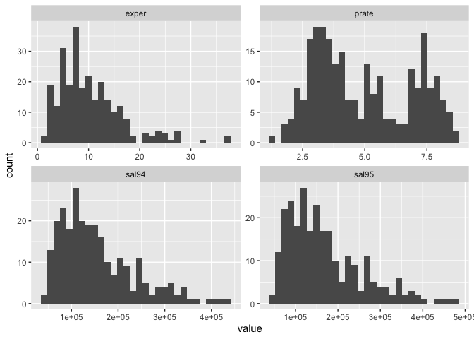

Data Analysis
================
12/7/2019

``` r
data = read_csv("data/Lawsuit.csv") %>% 
  janitor::clean_names() %>% 
  dplyr::select(-id) %>% 
  mutate(dept = as.factor(dept),
         gender = as.factor(gender),
         clin = as.factor(clin),
         cert = as.factor(cert),
         rank = as.factor(rank))
```

Look at the distribution of all variables.

``` r
data %>%   
  keep(is.numeric) %>% 
  gather() %>% 
  ggplot(aes(value)) +
    facet_wrap(~ key, scales = "free") +
    geom_histogram()
```

    ## `stat_bin()` using `bins = 30`. Pick better value with `binwidth`.

<!-- -->

``` r
lm(sal_average ~ . , data = data %>% mutate(sal_average = (sal94 + sal95)/2) %>% dplyr::select(-sal94, -sal95)) %>% 
  step(direction='backward') %>% 
  summary()
```

    ## Start:  AIC=5334.45
    ## sal_average ~ dept + gender + clin + cert + prate + exper + rank
    ## 
    ##          Df  Sum of Sq        RSS    AIC
    ## - gender  1 4.2153e+08 1.7813e+11 5333.1
    ## - prate   1 6.3543e+08 1.7834e+11 5333.4
    ## <none>                 1.7771e+11 5334.4
    ## - clin    1 3.1933e+09 1.8090e+11 5337.1
    ## - cert    1 1.6319e+10 1.9402e+11 5355.4
    ## - rank    2 3.2531e+10 2.1024e+11 5374.3
    ## - exper   1 5.4091e+10 2.3180e+11 5401.8
    ## - dept    5 3.6548e+11 5.4318e+11 5616.1
    ## 
    ## Step:  AIC=5333.06
    ## sal_average ~ dept + clin + cert + prate + exper + rank
    ## 
    ##         Df  Sum of Sq        RSS    AIC
    ## - prate  1 4.3242e+08 1.7856e+11 5331.7
    ## <none>                1.7813e+11 5333.1
    ## - clin   1 3.8681e+09 1.8199e+11 5336.7
    ## - cert   1 1.6135e+10 1.9426e+11 5353.7
    ## - rank   2 3.2441e+10 2.1057e+11 5372.7
    ## - exper  1 5.3990e+10 2.3212e+11 5400.2
    ## - dept   5 3.6876e+11 5.4688e+11 5615.8
    ## 
    ## Step:  AIC=5331.7
    ## sal_average ~ dept + clin + cert + exper + rank
    ## 
    ##         Df  Sum of Sq        RSS    AIC
    ## <none>                1.7856e+11 5331.7
    ## - cert   1 1.5979e+10 1.9454e+11 5352.1
    ## - clin   1 2.1488e+10 2.0005e+11 5359.4
    ## - rank   2 3.4286e+10 2.1285e+11 5373.5
    ## - exper  1 5.3559e+10 2.3212e+11 5398.2
    ## - dept   5 7.9354e+11 9.7210e+11 5764.0

    ## 
    ## Call:
    ## lm(formula = sal_average ~ dept + clin + cert + exper + rank, 
    ##     data = data %>% mutate(sal_average = (sal94 + sal95)/2) %>% 
    ##         dplyr::select(-sal94, -sal95))
    ## 
    ## Residuals:
    ##    Min     1Q Median     3Q    Max 
    ## -81412 -15100   -433  13411 147363 
    ## 
    ## Coefficients:
    ##             Estimate Std. Error t value Pr(>|t|)    
    ## (Intercept)  26744.7     5411.6   4.942 1.42e-06 ***
    ## dept2       -12439.5     5815.9  -2.139 0.033416 *  
    ## dept3        26023.9     7294.9   3.567 0.000432 ***
    ## dept4        29602.3     7122.9   4.156 4.45e-05 ***
    ## dept5        82760.1     5881.9  14.070  < 2e-16 ***
    ## dept6       187444.4     6973.5  26.880  < 2e-16 ***
    ## clin1        23996.0     4374.8   5.485 1.01e-07 ***
    ## cert1        20076.8     4244.6   4.730 3.76e-06 ***
    ## exper         3107.0      358.8   8.660 5.95e-16 ***
    ## rank2        17862.3     4606.0   3.878 0.000135 ***
    ## rank3        35265.8     5093.3   6.924 3.69e-11 ***
    ## ---
    ## Signif. codes:  0 '***' 0.001 '**' 0.01 '*' 0.05 '.' 0.1 ' ' 1
    ## 
    ## Residual standard error: 26730 on 250 degrees of freedom
    ## Multiple R-squared:  0.9041, Adjusted R-squared:  0.9002 
    ## F-statistic: 235.6 on 10 and 250 DF,  p-value: < 2.2e-16

``` r
lm(sal_average ~ . , data = data %>% mutate(sal_average = (sal94 + sal95)/2) %>% dplyr::select(-sal94, -sal95) %>% filter(gender == 0) %>% dplyr::select(-gender)) %>% 
  step(direction='backward') %>% 
  summary()
```

    ## Start:  AIC=2108.73
    ## sal_average ~ dept + clin + cert + prate + exper + rank
    ## 
    ##         Df  Sum of Sq        RSS    AIC
    ## - clin   1 4.5531e+08 3.7328e+10 2108.0
    ## <none>                3.6872e+10 2108.7
    ## - prate  1 8.4008e+08 3.7713e+10 2109.1
    ## - cert   1 5.8868e+09 4.2759e+10 2122.4
    ## - rank   2 7.0065e+09 4.3879e+10 2123.2
    ## - exper  1 8.0228e+09 4.4895e+10 2127.6
    ## - dept   5 8.5565e+10 1.2244e+11 2225.9
    ## 
    ## Step:  AIC=2108.03
    ## sal_average ~ dept + cert + prate + exper + rank
    ## 
    ##         Df  Sum of Sq        RSS    AIC
    ## <none>                3.7328e+10 2108.0
    ## - cert   1 6.2256e+09 4.3553e+10 2122.4
    ## - rank   2 7.5094e+09 4.4837e+10 2123.5
    ## - exper  1 7.8790e+09 4.5207e+10 2126.3
    ## - prate  1 9.0159e+09 4.6344e+10 2129.0
    ## - dept   5 8.7395e+10 1.2472e+11 2225.9

    ## 
    ## Call:
    ## lm(formula = sal_average ~ dept + cert + prate + exper + rank, 
    ##     data = data %>% mutate(sal_average = (sal94 + sal95)/2) %>% 
    ##         dplyr::select(-sal94, -sal95) %>% filter(gender == 0) %>% 
    ##         dplyr::select(-gender))
    ## 
    ## Residuals:
    ##    Min     1Q Median     3Q    Max 
    ## -45906 -10735  -1369  10085  69769 
    ## 
    ## Coefficients:
    ##             Estimate Std. Error t value Pr(>|t|)    
    ## (Intercept) 110889.7    15927.2   6.962 4.31e-10 ***
    ## dept2       -13399.2     6621.8  -2.024 0.045830 *  
    ## dept3        11883.5     7865.0   1.511 0.134121    
    ## dept4         1573.5    10040.8   0.157 0.875803    
    ## dept5        54067.0     9326.3   5.797 8.77e-08 ***
    ## dept6       133159.4    14056.9   9.473 2.21e-15 ***
    ## cert1        20650.7     5188.0   3.980 0.000134 ***
    ## prate        -9704.5     2025.9  -4.790 6.13e-06 ***
    ## exper         3139.7      701.1   4.478 2.10e-05 ***
    ## rank2        16145.2     5629.4   2.868 0.005089 ** 
    ## rank3        32889.8     7758.5   4.239 5.20e-05 ***
    ## ---
    ## Signif. codes:  0 '***' 0.001 '**' 0.01 '*' 0.05 '.' 0.1 ' ' 1
    ## 
    ## Residual standard error: 19820 on 95 degrees of freedom
    ## Multiple R-squared:  0.8982, Adjusted R-squared:  0.8875 
    ## F-statistic:  83.8 on 10 and 95 DF,  p-value: < 2.2e-16

``` r
lm(sal_average ~ . , data = data %>% mutate(sal_average = (sal94 + sal95)/2) %>% dplyr::select(-sal94, -sal95) %>% filter(gender == 1) %>% dplyr::select(-gender)) %>% 
  step(direction='backward') %>% 
  summary()
```

    ## Start:  AIC=3211.41
    ## sal_average ~ dept + clin + cert + prate + exper + rank
    ## 
    ##         Df  Sum of Sq        RSS    AIC
    ## - prate  1 4.5665e+07 1.3222e+11 3209.5
    ## <none>                1.3217e+11 3211.4
    ## - clin   1 3.3518e+09 1.3553e+11 3213.3
    ## - cert   1 9.2669e+09 1.4144e+11 3219.9
    ## - rank   2 2.7606e+10 1.5978e+11 3236.8
    ## - exper  1 3.9460e+10 1.7163e+11 3249.9
    ## - dept   5 2.3228e+11 3.6445e+11 3358.6
    ## 
    ## Step:  AIC=3209.47
    ## sal_average ~ dept + clin + cert + exper + rank
    ## 
    ##         Df  Sum of Sq        RSS    AIC
    ## <none>                1.3222e+11 3209.5
    ## - cert   1 9.2548e+09 1.4148e+11 3218.0
    ## - clin   1 1.1139e+10 1.4336e+11 3220.0
    ## - rank   2 2.7986e+10 1.6021e+11 3235.2
    ## - exper  1 3.9948e+10 1.7217e+11 3248.4
    ## - dept   5 5.8011e+11 7.1233e+11 3460.5

    ## 
    ## Call:
    ## lm(formula = sal_average ~ dept + clin + cert + exper + rank, 
    ##     data = data %>% mutate(sal_average = (sal94 + sal95)/2) %>% 
    ##         dplyr::select(-sal94, -sal95) %>% filter(gender == 1) %>% 
    ##         dplyr::select(-gender))
    ## 
    ## Residuals:
    ##    Min     1Q Median     3Q    Max 
    ## -80988 -16665  -1108  13399 150867 
    ## 
    ## Coefficients:
    ##             Estimate Std. Error t value Pr(>|t|)    
    ## (Intercept)  15638.9     8770.1   1.783 0.076658 .  
    ## dept2       -14119.8     8961.1  -1.576 0.117295    
    ## dept3        33145.1    12137.1   2.731 0.007106 ** 
    ## dept4        34665.1    12259.9   2.828 0.005359 ** 
    ## dept5        90558.9     8761.0  10.337  < 2e-16 ***
    ## dept6       196723.3     9898.1  19.875  < 2e-16 ***
    ## clin1        25596.5     7348.9   3.483 0.000657 ***
    ## cert1        21064.1     6634.8   3.175 0.001834 ** 
    ## exper         3008.4      456.1   6.596 7.49e-10 ***
    ## rank2        22912.0     7391.7   3.100 0.002331 ** 
    ## rank3        42645.1     7761.4   5.495 1.73e-07 ***
    ## ---
    ## Signif. codes:  0 '***' 0.001 '**' 0.01 '*' 0.05 '.' 0.1 ' ' 1
    ## 
    ## Residual standard error: 30300 on 144 degrees of freedom
    ## Multiple R-squared:  0.8949, Adjusted R-squared:  0.8876 
    ## F-statistic: 122.7 on 10 and 144 DF,  p-value: < 2.2e-16
