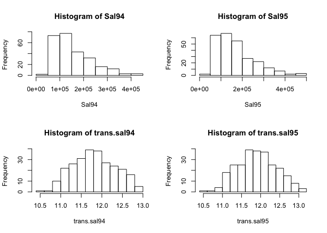
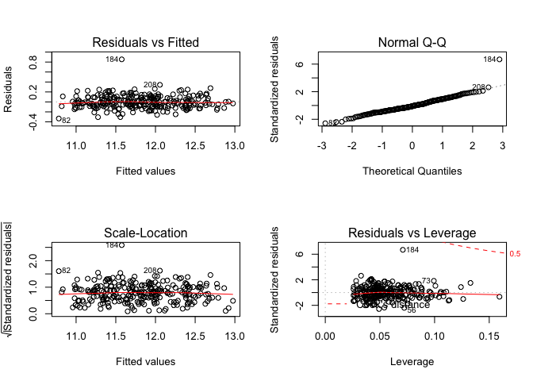
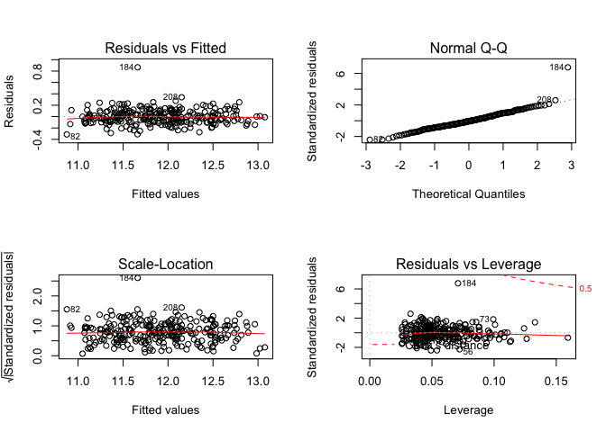
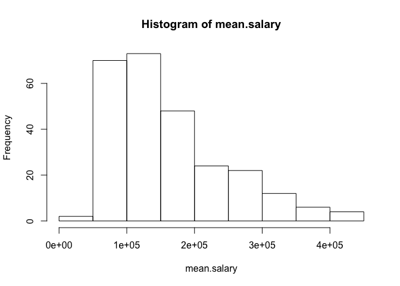
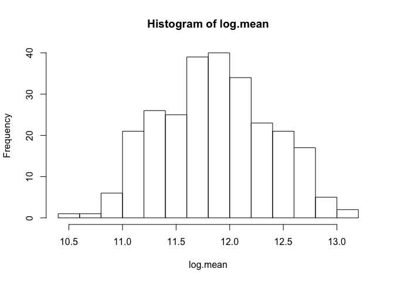
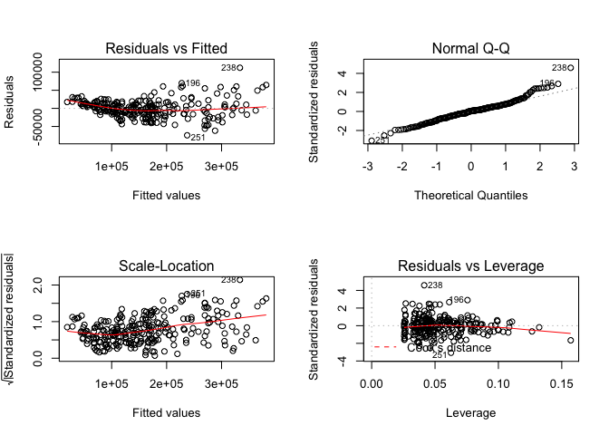

jennifer-draft
================
Jennifer Tang
12/10/2019

Libraries

``` r
library(arsenal)
library(dplyr)
```

    ## 
    ## Attaching package: 'dplyr'

    ## The following objects are masked from 'package:stats':
    ## 
    ##     filter, lag

    ## The following objects are masked from 'package:base':
    ## 
    ##     intersect, setdiff, setequal, union

``` r
library(HH)
```

    ## Loading required package: lattice

    ## Loading required package: grid

    ## Loading required package: latticeExtra

    ## Loading required package: RColorBrewer

    ## Loading required package: multcomp

    ## Loading required package: mvtnorm

    ## Loading required package: survival

    ## Loading required package: TH.data

    ## Loading required package: MASS

    ## 
    ## Attaching package: 'MASS'

    ## The following object is masked from 'package:dplyr':
    ## 
    ##     select

    ## 
    ## Attaching package: 'TH.data'

    ## The following object is masked from 'package:MASS':
    ## 
    ##     geyser

    ## Loading required package: gridExtra

    ## 
    ## Attaching package: 'gridExtra'

    ## The following object is masked from 'package:dplyr':
    ## 
    ##     combine

Importing data

``` r
library(readr)
Lawsuit <- read_csv("data/Lawsuit.csv")
```

    ## Parsed with column specification:
    ## cols(
    ##   ID = col_double(),
    ##   Dept = col_double(),
    ##   Gender = col_double(),
    ##   Clin = col_double(),
    ##   Cert = col_double(),
    ##   Prate = col_double(),
    ##   Exper = col_double(),
    ##   Rank = col_double(),
    ##   Sal94 = col_double(),
    ##   Sal95 = col_double()
    ## )

``` r
View(Lawsuit)
attach(Lawsuit)
```

Descriptive Statistics

``` r
dept=as.factor(Lawsuit$Dept)
dept= recode(dept, "1"="Biochemistry/Molecular Biology", "2"="Physiology", 
             "3"="Genetics", "4"="Pediatrics", "5"="Medicine", "6"="Surgery")
gender=as.factor(Lawsuit$Gender)
gender=recode(gender,"1"="Males","0"="Females")
clin=as.factor(Lawsuit$Clin)
clin=recode(clin, "1"="Primarily clinical emphasis", "0"="Primarily research emphasis")
cert= as.factor(Lawsuit$Cert)
cert= recode(cert, "1"="Board Certified", "0"="Not Certified")
rank=as.factor(Lawsuit$Rank)
rank=recode(rank, "1"="Assistant", "2"="Associate", "3"="Full professor")
controls= tableby.control(test=FALSE, total=FALSE,
                          numeric.stats=c("meansd", "medianq1q3"),
                          stats.labels=list(meansd="Mean (SD)", medianq1q3="Median (IQR)"))
tab1= tableby(gender~dept+clin+cert+Prate+Exper+rank+Sal94+Sal95, data=Lawsuit, test=FALSE, 
              total=FALSE, control=controls, digits=2)
summary(tab1, text=TRUE)
```

    ## 
    ## 
    ## |                                  |         Females (N=106)         |          Males (N=155)           |
    ## |:---------------------------------|:-------------------------------:|:--------------------------------:|
    ## |dept                              |                                 |                                  |
    ## |-  Biochemistry/Molecular Biology |           20 (18.9%)            |            30 (19.4%)            |
    ## |-  Physiology                     |           20 (18.9%)            |            20 (12.9%)            |
    ## |-  Genetics                       |           11 (10.4%)            |            10 (6.5%)             |
    ## |-  Pediatrics                     |           20 (18.9%)            |            10 (6.5%)             |
    ## |-  Medicine                       |           30 (28.3%)            |            50 (32.3%)            |
    ## |-  Surgery                        |            5 (4.7%)             |            35 (22.6%)            |
    ## |clin                              |                                 |                                  |
    ## |-  Primarily research emphasis    |           46 (43.4%)            |            55 (35.5%)            |
    ## |-  Primarily clinical emphasis    |           60 (56.6%)            |           100 (64.5%)            |
    ## |cert                              |                                 |                                  |
    ## |-  Not Certified                  |           36 (34.0%)            |            37 (23.9%)            |
    ## |-  Board Certified                |           70 (66.0%)            |           118 (76.1%)            |
    ## |Prate                             |                                 |                                  |
    ## |-  Mean (SD)                      |           5.35 (1.89)           |           4.65 (1.94)            |
    ## |-  Median (IQR)                   |        5.25 (3.73, 7.27)        |        4.00 (3.10, 6.70)         |
    ## |Exper                             |                                 |                                  |
    ## |-  Mean (SD)                      |           7.49 (4.17)           |           12.10 (6.70)           |
    ## |-  Median (IQR)                   |       7.00 (5.00, 10.00)        |       10.00 (7.00, 15.00)        |
    ## |rank                              |                                 |                                  |
    ## |-  Assistant                      |           69 (65.1%)            |            43 (27.7%)            |
    ## |-  Associate                      |           21 (19.8%)            |            43 (27.7%)            |
    ## |-  Full professor                 |           16 (15.1%)            |            69 (44.5%)            |
    ## |Sal94                             |                                 |                                  |
    ## |-  Mean (SD)                      |      118871.27 (56168.01)       |       177338.76 (85930.54)       |
    ## |-  Median (IQR)                   | 108457.00 (75774.50, 143096.00) | 155006.00 (109687.00, 231501.50) |
    ## |Sal95                             |                                 |                                  |
    ## |-  Mean (SD)                      |      130876.92 (62034.51)       |       194914.09 (94902.73)       |
    ## |-  Median (IQR)                   | 119135.00 (82345.25, 154170.50) | 170967.00 (119952.50, 257163.00) |

Distribution of Salary

``` r
par(mfrow=c(2,2))
hist(Sal94)
hist(Sal95)
trans.sal94=log(Sal94)
trans.sal95= log(Sal95)
hist(trans.sal94)
hist(trans.sal95)
```

<!-- -->

Looking at Salary in 1994

``` r
###  confounders
mod94=lm(trans.sal94~gender); summary(mod94) 
```

    ## 
    ## Call:
    ## lm(formula = trans.sal94 ~ gender)
    ## 
    ## Residuals:
    ##      Min       1Q   Median       3Q      Max 
    ## -1.13519 -0.36436 -0.00331  0.33580  1.05381 
    ## 
    ## Coefficients:
    ##             Estimate Std. Error t value Pr(>|t|)    
    ## (Intercept) 11.58431    0.04587 252.535  < 2e-16 ***
    ## genderMales  0.38624    0.05953   6.489 4.38e-10 ***
    ## ---
    ## Signif. codes:  0 '***' 0.001 '**' 0.01 '*' 0.05 '.' 0.1 ' ' 1
    ## 
    ## Residual standard error: 0.4723 on 259 degrees of freedom
    ## Multiple R-squared:  0.1398, Adjusted R-squared:  0.1365 
    ## F-statistic:  42.1 on 1 and 259 DF,  p-value: 4.378e-10

``` r
# gender-dept
summary(lm(trans.sal94~gender+dept))
```

    ## 
    ## Call:
    ## lm(formula = trans.sal94 ~ gender + dept)
    ## 
    ## Residuals:
    ##     Min      1Q  Median      3Q     Max 
    ## -0.7155 -0.1902 -0.0254  0.1681  0.6001 
    ## 
    ## Coefficients:
    ##                Estimate Std. Error t value Pr(>|t|)    
    ## (Intercept)    11.29781    0.04105 275.230  < 2e-16 ***
    ## genderMales     0.20616    0.03351   6.152 2.95e-09 ***
    ## deptPhysiology -0.13322    0.05379  -2.477  0.01390 *  
    ## deptGenetics    0.20042    0.06593   3.040  0.00262 ** 
    ## deptPediatrics  0.30059    0.05912   5.084 7.17e-07 ***
    ## deptMedicine    0.64841    0.04563  14.211  < 2e-16 ***
    ## deptSurgery     1.07295    0.05447  19.699  < 2e-16 ***
    ## ---
    ## Signif. codes:  0 '***' 0.001 '**' 0.01 '*' 0.05 '.' 0.1 ' ' 1
    ## 
    ## Residual standard error: 0.2531 on 254 degrees of freedom
    ## Multiple R-squared:  0.7578, Adjusted R-squared:  0.7521 
    ## F-statistic: 132.5 on 6 and 254 DF,  p-value: < 2.2e-16

``` r
# gender-clin
summary(lm(trans.sal94~gender+clin))
```

    ## 
    ## Call:
    ## lm(formula = trans.sal94 ~ gender + clin)
    ## 
    ## Residuals:
    ##      Min       1Q   Median       3Q      Max 
    ## -1.01542 -0.25336 -0.01515  0.24663  0.98543 
    ## 
    ## Coefficients:
    ##                                 Estimate Std. Error t value Pr(>|t|)    
    ## (Intercept)                     11.24181    0.04472  251.36  < 2e-16 ***
    ## genderMales                      0.33836    0.04673    7.24 5.15e-12 ***
    ## clinPrimarily clinical emphasis  0.60508    0.04712   12.84  < 2e-16 ***
    ## ---
    ## Signif. codes:  0 '***' 0.001 '**' 0.01 '*' 0.05 '.' 0.1 ' ' 1
    ## 
    ## Residual standard error: 0.3696 on 258 degrees of freedom
    ## Multiple R-squared:  0.4752, Adjusted R-squared:  0.4711 
    ## F-statistic: 116.8 on 2 and 258 DF,  p-value: < 2.2e-16

``` r
# gender-cert
summary(lm(trans.sal94~gender+cert))
```

    ## 
    ## Call:
    ## lm(formula = trans.sal94 ~ gender + cert)
    ## 
    ## Residuals:
    ##      Min       1Q   Median       3Q      Max 
    ## -1.12431 -0.27551 -0.01416  0.31035  1.03137 
    ## 
    ## Coefficients:
    ##                     Estimate Std. Error t value Pr(>|t|)    
    ## (Intercept)         11.24092    0.05497 204.490  < 2e-16 ***
    ## genderMales          0.33376    0.05221   6.393 7.57e-10 ***
    ## certBoard Certified  0.52000    0.05712   9.103  < 2e-16 ***
    ## ---
    ## Signif. codes:  0 '***' 0.001 '**' 0.01 '*' 0.05 '.' 0.1 ' ' 1
    ## 
    ## Residual standard error: 0.4117 on 258 degrees of freedom
    ## Multiple R-squared:  0.349,  Adjusted R-squared:  0.3439 
    ## F-statistic: 69.14 on 2 and 258 DF,  p-value: < 2.2e-16

``` r
# gender-Prate
summary(lm(trans.sal94~gender+Prate))
```

    ## 
    ## Call:
    ## lm(formula = trans.sal94 ~ gender + Prate)
    ## 
    ## Residuals:
    ##     Min      1Q  Median      3Q     Max 
    ## -0.8190 -0.1894  0.0079  0.1905  0.7439 
    ## 
    ## Coefficients:
    ##              Estimate Std. Error t value Pr(>|t|)    
    ## (Intercept) 12.595496   0.060325 208.794  < 2e-16 ***
    ## genderMales  0.253262   0.038875   6.515 3.79e-10 ***
    ## Prate       -0.189006   0.009838 -19.213  < 2e-16 ***
    ## ---
    ## Signif. codes:  0 '***' 0.001 '**' 0.01 '*' 0.05 '.' 0.1 ' ' 1
    ## 
    ## Residual standard error: 0.3035 on 258 degrees of freedom
    ## Multiple R-squared:  0.6461, Adjusted R-squared:  0.6434 
    ## F-statistic: 235.5 on 2 and 258 DF,  p-value: < 2.2e-16

``` r
# gender-Exper
summary(lm(trans.sal94~gender+Exper))
```

    ## 
    ## Call:
    ## lm(formula = trans.sal94 ~ gender + Exper)
    ## 
    ## Residuals:
    ##      Min       1Q   Median       3Q      Max 
    ## -1.04273 -0.37295  0.03363  0.33486  1.02839 
    ## 
    ## Coefficients:
    ##              Estimate Std. Error t value Pr(>|t|)    
    ## (Intercept) 11.458175   0.058285 196.590  < 2e-16 ***
    ## genderMales  0.308563   0.062657   4.925 1.51e-06 ***
    ## Exper        0.016839   0.004951   3.401 0.000777 ***
    ## ---
    ## Signif. codes:  0 '***' 0.001 '**' 0.01 '*' 0.05 '.' 0.1 ' ' 1
    ## 
    ## Residual standard error: 0.4629 on 258 degrees of freedom
    ## Multiple R-squared:  0.1767, Adjusted R-squared:  0.1704 
    ## F-statistic: 27.69 on 2 and 258 DF,  p-value: 1.271e-11

``` r
# gender- rank
summary(lm(trans.sal94~gender+rank))
```

    ## 
    ## Call:
    ## lm(formula = trans.sal94 ~ gender + rank)
    ## 
    ## Residuals:
    ##      Min       1Q   Median       3Q      Max 
    ## -1.11794 -0.38674  0.01841  0.35616  1.04154 
    ## 
    ## Coefficients:
    ##                    Estimate Std. Error t value Pr(>|t|)    
    ## (Intercept)        11.56706    0.05087 227.373  < 2e-16 ***
    ## genderMales         0.35061    0.06431   5.452 1.17e-07 ***
    ## rankAssociate      -0.00653    0.07605  -0.086   0.9316    
    ## rankFull professor  0.12284    0.07309   1.681   0.0941 .  
    ## ---
    ## Signif. codes:  0 '***' 0.001 '**' 0.01 '*' 0.05 '.' 0.1 ' ' 1
    ## 
    ## Residual standard error: 0.4707 on 257 degrees of freedom
    ## Multiple R-squared:  0.152,  Adjusted R-squared:  0.1421 
    ## F-statistic: 15.36 on 3 and 257 DF,  p-value: 3.193e-09

``` r
#### interactions: dept, experience, rank

#gender-dept
summary(lm(trans.sal94~gender*dept))
```

    ## 
    ## Call:
    ## lm(formula = trans.sal94 ~ gender * dept)
    ## 
    ## Residuals:
    ##     Min      1Q  Median      3Q     Max 
    ## -0.6593 -0.1864 -0.0359  0.1673  0.6492 
    ## 
    ## Coefficients:
    ##                              Estimate Std. Error t value Pr(>|t|)    
    ## (Intercept)                11.3210096  0.0564693 200.481  < 2e-16 ***
    ## genderMales                 0.1674974  0.0729016   2.298 0.022415 *  
    ## deptPhysiology             -0.2125666  0.0798597  -2.662 0.008279 ** 
    ## deptGenetics                0.0960468  0.0947975   1.013 0.311958    
    ## deptPediatrics              0.3024575  0.0798597   3.787 0.000191 ***
    ## deptMedicine                0.6497948  0.0729016   8.913  < 2e-16 ***
    ## deptSurgery                 1.1123759  0.1262692   8.810  < 2e-16 ***
    ## genderMales:deptPhysiology  0.1509514  0.1081305   1.396 0.163954    
    ## genderMales:deptGenetics    0.2091415  0.1322497   1.581 0.115053    
    ## genderMales:deptPediatrics -0.0365429  0.1219876  -0.300 0.764761    
    ## genderMales:deptMedicine   -0.0006635  0.0933595  -0.007 0.994335    
    ## genderMales:deptSurgery    -0.0329106  0.1410387  -0.233 0.815686    
    ## ---
    ## Signif. codes:  0 '***' 0.001 '**' 0.01 '*' 0.05 '.' 0.1 ' ' 1
    ## 
    ## Residual standard error: 0.2525 on 249 degrees of freedom
    ## Multiple R-squared:  0.7636, Adjusted R-squared:  0.7531 
    ## F-statistic:  73.1 on 11 and 249 DF,  p-value: < 2.2e-16

``` r
# gender-experience 
summary(lm(trans.sal94~gender*Exper))
```

    ## 
    ## Call:
    ## lm(formula = trans.sal94 ~ gender * Exper)
    ## 
    ## Residuals:
    ##      Min       1Q   Median       3Q      Max 
    ## -1.00503 -0.36180  0.02023  0.34885  1.00884 
    ## 
    ## Coefficients:
    ##                   Estimate Std. Error t value Pr(>|t|)    
    ## (Intercept)       11.36119    0.09270 122.563  < 2e-16 ***
    ## genderMales        0.44682    0.12039   3.712 0.000253 ***
    ## Exper              0.02979    0.01083   2.751 0.006359 ** 
    ## genderMales:Exper -0.01636    0.01217  -1.344 0.180065    
    ## ---
    ## Signif. codes:  0 '***' 0.001 '**' 0.01 '*' 0.05 '.' 0.1 ' ' 1
    ## 
    ## Residual standard error: 0.4622 on 257 degrees of freedom
    ## Multiple R-squared:  0.1825, Adjusted R-squared:  0.1729 
    ## F-statistic: 19.12 on 3 and 257 DF,  p-value: 3.174e-11

``` r
#gender-rank
summary(lm(trans.sal94~gender*rank))
```

    ## 
    ## Call:
    ## lm(formula = trans.sal94 ~ gender * rank)
    ## 
    ## Residuals:
    ##      Min       1Q   Median       3Q      Max 
    ## -1.05271 -0.37554  0.01028  0.34601  0.97298 
    ## 
    ## Coefficients:
    ##                                Estimate Std. Error t value Pr(>|t|)    
    ## (Intercept)                    11.50183    0.05607 205.133  < 2e-16 ***
    ## genderMales                     0.52052    0.09049   5.752 2.52e-08 ***
    ## rankAssociate                   0.12726    0.11608   1.096  0.27398    
    ## rankFull professor              0.37940    0.12924   2.936  0.00363 ** 
    ## genderMales:rankAssociate      -0.27194    0.15350  -1.772  0.07766 .  
    ## genderMales:rankFull professor -0.40560    0.15777  -2.571  0.01071 *  
    ## ---
    ## Signif. codes:  0 '***' 0.001 '**' 0.01 '*' 0.05 '.' 0.1 ' ' 1
    ## 
    ## Residual standard error: 0.4658 on 255 degrees of freedom
    ## Multiple R-squared:  0.1764, Adjusted R-squared:  0.1602 
    ## F-statistic: 10.92 on 5 and 255 DF,  p-value: 1.551e-09

``` r
f1=lm(trans.sal94~dept+clin+cert+Prate+Exper+rank*gender)
summary(f1)
```

    ## 
    ## Call:
    ## lm(formula = trans.sal94 ~ dept + clin + cert + Prate + Exper + 
    ##     rank * gender)
    ## 
    ## Residuals:
    ##      Min       1Q   Median       3Q      Max 
    ## -0.33296 -0.08351 -0.01394  0.08565  0.85417 
    ## 
    ## Coefficients:
    ##                                  Estimate Std. Error t value Pr(>|t|)    
    ## (Intercept)                     11.086860   0.133855  82.827  < 2e-16 ***
    ## deptPhysiology                  -0.175982   0.028881  -6.093 4.24e-09 ***
    ## deptGenetics                     0.168092   0.038533   4.362 1.89e-05 ***
    ## deptPediatrics                   0.151496   0.053322   2.841 0.004872 ** 
    ## deptMedicine                     0.497990   0.045023  11.061  < 2e-16 ***
    ## deptSurgery                      0.862242   0.061257  14.076  < 2e-16 ***
    ## clinPrimarily clinical emphasis  0.147083   0.041200   3.570 0.000429 ***
    ## certBoard Certified              0.194755   0.021390   9.105  < 2e-16 ***
    ## Prate                           -0.023014   0.017247  -1.334 0.183307    
    ## Exper                            0.018453   0.001822  10.126  < 2e-16 ***
    ## rankAssociate                    0.169818   0.033953   5.002 1.08e-06 ***
    ## rankFull professor               0.280968   0.039637   7.088 1.43e-11 ***
    ## genderMales                      0.070659   0.027953   2.528 0.012105 *  
    ## rankAssociate:genderMales       -0.084204   0.044766  -1.881 0.061155 .  
    ## rankFull professor:genderMales  -0.109202   0.046682  -2.339 0.020122 *  
    ## ---
    ## Signif. codes:  0 '***' 0.001 '**' 0.01 '*' 0.05 '.' 0.1 ' ' 1
    ## 
    ## Residual standard error: 0.1326 on 246 degrees of freedom
    ## Multiple R-squared:  0.9356, Adjusted R-squared:  0.932 
    ## F-statistic: 255.3 on 14 and 246 DF,  p-value: < 2.2e-16

Residual plots for model 1994

``` r
par(mfrow=c(2,2))
plot(f1)
```

<!-- -->

Looking at Salary in 1995

``` r
mod95=lm(trans.sal95~gender);summary(mod95)
```

    ## 
    ## Call:
    ## lm(formula = trans.sal95 ~ gender)
    ## 
    ## Residuals:
    ##      Min       1Q   Median       3Q      Max 
    ## -1.11677 -0.36995 -0.00796  0.33653  1.05600 
    ## 
    ## Coefficients:
    ##             Estimate Std. Error t value Pr(>|t|)    
    ## (Intercept) 11.67971    0.04604 253.678  < 2e-16 ***
    ## genderMales  0.38446    0.05975   6.435 5.94e-10 ***
    ## ---
    ## Signif. codes:  0 '***' 0.001 '**' 0.01 '*' 0.05 '.' 0.1 ' ' 1
    ## 
    ## Residual standard error: 0.474 on 259 degrees of freedom
    ## Multiple R-squared:  0.1378, Adjusted R-squared:  0.1345 
    ## F-statistic: 41.41 on 1 and 259 DF,  p-value: 5.939e-10

``` r
# gender-dept
summary(lm(trans.sal95~gender+dept))
```

    ## 
    ## Call:
    ## lm(formula = trans.sal95 ~ gender + dept)
    ## 
    ## Residuals:
    ##      Min       1Q   Median       3Q      Max 
    ## -0.69629 -0.19180 -0.02453  0.16602  0.61483 
    ## 
    ## Coefficients:
    ##                Estimate Std. Error t value Pr(>|t|)    
    ## (Intercept)    11.39005    0.04120 276.472  < 2e-16 ***
    ## genderMales     0.20435    0.03363   6.076 4.48e-09 ***
    ## deptPhysiology -0.13082    0.05398  -2.423  0.01608 *  
    ## deptGenetics    0.20137    0.06617   3.043  0.00259 ** 
    ## deptPediatrics  0.30971    0.05934   5.220 3.73e-07 ***
    ## deptMedicine    0.65036    0.04579  14.202  < 2e-16 ***
    ## deptSurgery     1.08008    0.05466  19.758  < 2e-16 ***
    ## ---
    ## Signif. codes:  0 '***' 0.001 '**' 0.01 '*' 0.05 '.' 0.1 ' ' 1
    ## 
    ## Residual standard error: 0.254 on 254 degrees of freedom
    ## Multiple R-squared:  0.7573, Adjusted R-squared:  0.7515 
    ## F-statistic: 132.1 on 6 and 254 DF,  p-value: < 2.2e-16

``` r
# gender-clin
summary(lm(trans.sal95~gender+clin))
```

    ## 
    ## Call:
    ## lm(formula = trans.sal95 ~ gender + clin)
    ## 
    ## Residuals:
    ##      Min       1Q   Median       3Q      Max 
    ## -1.00900 -0.24730 -0.02408  0.25889  1.00233 
    ## 
    ## Coefficients:
    ##                                 Estimate Std. Error t value Pr(>|t|)    
    ## (Intercept)                     11.33385    0.04471 253.481  < 2e-16 ***
    ## genderMales                      0.33611    0.04672   7.194 6.83e-12 ***
    ## clinPrimarily clinical emphasis  0.61103    0.04711  12.970  < 2e-16 ***
    ## ---
    ## Signif. codes:  0 '***' 0.001 '**' 0.01 '*' 0.05 '.' 0.1 ' ' 1
    ## 
    ## Residual standard error: 0.3695 on 258 degrees of freedom
    ## Multiple R-squared:  0.4781, Adjusted R-squared:  0.4741 
    ## F-statistic: 118.2 on 2 and 258 DF,  p-value: < 2.2e-16

``` r
# gender-certs
summary(lm(trans.sal95~gender+cert))
```

    ## 
    ## Call:
    ## lm(formula = trans.sal95 ~ gender + cert)
    ## 
    ## Residuals:
    ##      Min       1Q   Median       3Q      Max 
    ## -1.11346 -0.27503 -0.01601  0.31130  1.00849 
    ## 
    ## Coefficients:
    ##                     Estimate Std. Error t value Pr(>|t|)    
    ## (Intercept)         11.33654    0.05525 205.186  < 2e-16 ***
    ## genderMales          0.33202    0.05247   6.328 1.09e-09 ***
    ## certBoard Certified  0.51966    0.05741   9.051  < 2e-16 ***
    ## ---
    ## Signif. codes:  0 '***' 0.001 '**' 0.01 '*' 0.05 '.' 0.1 ' ' 1
    ## 
    ## Residual standard error: 0.4138 on 258 degrees of freedom
    ## Multiple R-squared:  0.3456, Adjusted R-squared:  0.3406 
    ## F-statistic: 68.14 on 2 and 258 DF,  p-value: < 2.2e-16

``` r
# gender-Prate
summary(lm(trans.sal95~gender+Prate))
```

    ## 
    ## Call:
    ## lm(formula = trans.sal95 ~ gender + Prate)
    ## 
    ## Residuals:
    ##      Min       1Q   Median       3Q      Max 
    ## -0.78802 -0.19404  0.00571  0.19685  0.74215 
    ## 
    ## Coefficients:
    ##              Estimate Std. Error t value Pr(>|t|)    
    ## (Intercept) 12.698415   0.060223 210.856  < 2e-16 ***
    ## genderMales  0.250498   0.038809   6.455 5.34e-10 ***
    ## Prate       -0.190412   0.009821 -19.388  < 2e-16 ***
    ## ---
    ## Signif. codes:  0 '***' 0.001 '**' 0.01 '*' 0.05 '.' 0.1 ' ' 1
    ## 
    ## Residual standard error: 0.303 on 258 degrees of freedom
    ## Multiple R-squared:  0.6491, Adjusted R-squared:  0.6464 
    ## F-statistic: 238.6 on 2 and 258 DF,  p-value: < 2.2e-16

``` r
# gender-Exper
summary(lm(trans.sal95~gender+Exper))
```

    ## 
    ## Call:
    ## lm(formula = trans.sal95 ~ gender + Exper)
    ## 
    ## Residuals:
    ##      Min       1Q   Median       3Q      Max 
    ## -1.02413 -0.36838  0.03979  0.33238  1.03053 
    ## 
    ## Coefficients:
    ##             Estimate Std. Error t value Pr(>|t|)    
    ## (Intercept) 11.55333    0.05850 197.478  < 2e-16 ***
    ## genderMales  0.30664    0.06289   4.876  1.9e-06 ***
    ## Exper        0.01687    0.00497   3.395 0.000794 ***
    ## ---
    ## Signif. codes:  0 '***' 0.001 '**' 0.01 '*' 0.05 '.' 0.1 ' ' 1
    ## 
    ## Residual standard error: 0.4647 on 258 degrees of freedom
    ## Multiple R-squared:  0.1747, Adjusted R-squared:  0.1683 
    ## F-statistic: 27.31 on 2 and 258 DF,  p-value: 1.746e-11

``` r
# gender- rank
summary(lm(trans.sal95~gender+rank))
```

    ## 
    ## Call:
    ## lm(formula = trans.sal95 ~ gender + rank)
    ## 
    ## Residuals:
    ##      Min       1Q   Median       3Q      Max 
    ## -1.09892 -0.36842  0.00988  0.35437  1.02970 
    ## 
    ## Coefficients:
    ##                     Estimate Std. Error t value Pr(>|t|)    
    ## (Intercept)        11.661874   0.051066 228.367  < 2e-16 ***
    ## genderMales         0.348458   0.064549   5.398 1.53e-07 ***
    ## rankAssociate      -0.004008   0.076341  -0.053   0.9582    
    ## rankFull professor  0.123452   0.073370   1.683   0.0937 .  
    ## ---
    ## Signif. codes:  0 '***' 0.001 '**' 0.01 '*' 0.05 '.' 0.1 ' ' 1
    ## 
    ## Residual standard error: 0.4725 on 257 degrees of freedom
    ## Multiple R-squared:  0.1499, Adjusted R-squared:   0.14 
    ## F-statistic:  15.1 on 3 and 257 DF,  p-value: 4.392e-09

``` r
# interaction of dept, exper, rank
summary(lm(trans.sal95~gender*dept)) 
```

    ## 
    ## Call:
    ## lm(formula = trans.sal95 ~ gender * dept)
    ## 
    ## Residuals:
    ##      Min       1Q   Median       3Q      Max 
    ## -0.64112 -0.18679 -0.03565  0.16506  0.66896 
    ## 
    ## Coefficients:
    ##                             Estimate Std. Error t value Pr(>|t|)    
    ## (Intercept)                11.412356   0.056705 201.258  < 2e-16 ***
    ## genderMales                 0.167174   0.073206   2.284 0.023237 *  
    ## deptPhysiology             -0.208284   0.080193  -2.597 0.009956 ** 
    ## deptGenetics                0.098963   0.095193   1.040 0.299535    
    ## deptPediatrics              0.309092   0.080193   3.854 0.000148 ***
    ## deptMedicine                0.654222   0.073206   8.937  < 2e-16 ***
    ## deptSurgery                 1.121698   0.126797   8.846  < 2e-16 ***
    ## genderMales:deptPhysiology  0.147504   0.108582   1.358 0.175549    
    ## genderMales:deptGenetics    0.205395   0.132802   1.547 0.123223    
    ## genderMales:deptPediatrics -0.027886   0.122497  -0.228 0.820107    
    ## genderMales:deptMedicine   -0.004699   0.093749  -0.050 0.960064    
    ## genderMales:deptSurgery    -0.035876   0.141628  -0.253 0.800234    
    ## ---
    ## Signif. codes:  0 '***' 0.001 '**' 0.01 '*' 0.05 '.' 0.1 ' ' 1
    ## 
    ## Residual standard error: 0.2536 on 249 degrees of freedom
    ## Multiple R-squared:  0.7628, Adjusted R-squared:  0.7523 
    ## F-statistic: 72.79 on 11 and 249 DF,  p-value: < 2.2e-16

``` r
summary(lm(trans.sal95~gender*Exper)) 
```

    ## 
    ## Call:
    ## lm(formula = trans.sal95 ~ gender * Exper)
    ## 
    ## Residuals:
    ##      Min       1Q   Median       3Q      Max 
    ## -0.98460 -0.36424  0.00528  0.35412  1.01095 
    ## 
    ## Coefficients:
    ##                   Estimate Std. Error t value Pr(>|t|)    
    ## (Intercept)       11.45618    0.09305 123.122  < 2e-16 ***
    ## genderMales        0.44513    0.12084   3.683  0.00028 ***
    ## Exper              0.02984    0.01087   2.746  0.00646 ** 
    ## genderMales:Exper -0.01639    0.01222  -1.341  0.18099    
    ## ---
    ## Signif. codes:  0 '***' 0.001 '**' 0.01 '*' 0.05 '.' 0.1 ' ' 1
    ## 
    ## Residual standard error: 0.464 on 257 degrees of freedom
    ## Multiple R-squared:  0.1805, Adjusted R-squared:  0.1709 
    ## F-statistic: 18.86 on 3 and 257 DF,  p-value: 4.347e-11

``` r
summary(lm(trans.sal95~gender*rank)) 
```

    ## 
    ## Call:
    ## lm(formula = trans.sal95 ~ gender * rank)
    ## 
    ## Residuals:
    ##      Min       1Q   Median       3Q      Max 
    ## -1.03367 -0.37007  0.00941  0.35210  0.97658 
    ## 
    ## Coefficients:
    ##                                Estimate Std. Error t value Pr(>|t|)    
    ## (Intercept)                    11.59662    0.05629 206.018  < 2e-16 ***
    ## genderMales                     0.51842    0.09085   5.707 3.19e-08 ***
    ## rankAssociate                   0.12984    0.11653   1.114   0.2663    
    ## rankFull professor              0.38009    0.12974   2.930   0.0037 ** 
    ## genderMales:rankAssociate      -0.27205    0.15410  -1.765   0.0787 .  
    ## genderMales:rankFull professor -0.40573    0.15838  -2.562   0.0110 *  
    ## ---
    ## Signif. codes:  0 '***' 0.001 '**' 0.01 '*' 0.05 '.' 0.1 ' ' 1
    ## 
    ## Residual standard error: 0.4676 on 255 degrees of freedom
    ## Multiple R-squared:  0.1741, Adjusted R-squared:  0.1579 
    ## F-statistic: 10.75 on 5 and 255 DF,  p-value: 2.158e-09

``` r
f2=lm(trans.sal95~dept+clin+cert+Prate+Exper+rank*gender)
summary(f2)
```

    ## 
    ## Call:
    ## lm(formula = trans.sal95 ~ dept + clin + cert + Prate + Exper + 
    ##     rank * gender)
    ## 
    ## Residuals:
    ##      Min       1Q   Median       3Q      Max 
    ## -0.31235 -0.08109 -0.00735  0.07479  0.86658 
    ## 
    ## Coefficients:
    ##                                  Estimate Std. Error t value Pr(>|t|)    
    ## (Intercept)                     11.173698   0.134011  83.379  < 2e-16 ***
    ## deptPhysiology                  -0.174729   0.028915  -6.043 5.57e-09 ***
    ## deptGenetics                     0.166565   0.038578   4.318 2.29e-05 ***
    ## deptPediatrics                   0.160616   0.053385   3.009 0.002897 ** 
    ## deptMedicine                     0.498763   0.045076  11.065  < 2e-16 ***
    ## deptSurgery                      0.868693   0.061329  14.165  < 2e-16 ***
    ## clinPrimarily clinical emphasis  0.155385   0.041249   3.767 0.000207 ***
    ## certBoard Certified              0.190323   0.021415   8.888  < 2e-16 ***
    ## Prate                           -0.022321   0.017267  -1.293 0.197321    
    ## Exper                            0.018520   0.001824  10.151  < 2e-16 ***
    ## rankAssociate                    0.172180   0.033993   5.065 8.01e-07 ***
    ## rankFull professor               0.279584   0.039684   7.045 1.85e-11 ***
    ## genderMales                      0.066502   0.027985   2.376 0.018252 *  
    ## rankAssociate:genderMales       -0.082747   0.044818  -1.846 0.066054 .  
    ## rankFull professor:genderMales  -0.104421   0.046736  -2.234 0.026365 *  
    ## ---
    ## Signif. codes:  0 '***' 0.001 '**' 0.01 '*' 0.05 '.' 0.1 ' ' 1
    ## 
    ## Residual standard error: 0.1327 on 246 degrees of freedom
    ## Multiple R-squared:  0.9358, Adjusted R-squared:  0.9321 
    ## F-statistic: 256.1 on 14 and 246 DF,  p-value: < 2.2e-16

Residual plots for 1995

``` r
par(mfrow=c(2,2))
plot(f2)
```

<!-- -->

Average Salary of 1994 and 1995

``` r
mean.salary=(Sal94+Sal95)/2
hist(mean.salary)
```

<!-- -->

``` r
log.mean=log(mean.salary)
hist(log.mean)
```

<!-- -->

``` r
mean.mod=lm(log.mean~gender); summary(mean.mod)
```

    ## 
    ## Call:
    ## lm(formula = log.mean ~ gender)
    ## 
    ## Residuals:
    ##     Min      1Q  Median      3Q     Max 
    ## -1.1255 -0.3659 -0.0078  0.3342  1.0549 
    ## 
    ## Coefficients:
    ##             Estimate Std. Error t value Pr(>|t|)    
    ## (Intercept) 11.63319    0.04595 253.162  < 2e-16 ***
    ## genderMales  0.38530    0.05963   6.462  5.1e-10 ***
    ## ---
    ## Signif. codes:  0 '***' 0.001 '**' 0.01 '*' 0.05 '.' 0.1 ' ' 1
    ## 
    ## Residual standard error: 0.4731 on 259 degrees of freedom
    ## Multiple R-squared:  0.1388, Adjusted R-squared:  0.1355 
    ## F-statistic: 41.75 on 1 and 259 DF,  p-value: 5.103e-10

``` r
# there is association between mean salary of 1994 and 1995 and gender

#confounders
summary(lm(log.mean~gender+dept)) # confounder
```

    ## 
    ## Call:
    ## lm(formula = log.mean ~ gender + dept)
    ## 
    ## Residuals:
    ##      Min       1Q   Median       3Q      Max 
    ## -0.70544 -0.19433 -0.02501  0.16341  0.60779 
    ## 
    ## Coefficients:
    ##                Estimate Std. Error t value Pr(>|t|)    
    ## (Intercept)    11.34504    0.04110 276.036  < 2e-16 ***
    ## genderMales     0.20521    0.03355   6.116 3.60e-09 ***
    ## deptPhysiology -0.13194    0.05385  -2.450  0.01496 *  
    ## deptGenetics    0.20092    0.06602   3.044  0.00258 ** 
    ## deptPediatrics  0.30535    0.05919   5.158 5.02e-07 ***
    ## deptMedicine    0.64943    0.04569  14.215  < 2e-16 ***
    ## deptSurgery     1.07668    0.05453  19.743  < 2e-16 ***
    ## ---
    ## Signif. codes:  0 '***' 0.001 '**' 0.01 '*' 0.05 '.' 0.1 ' ' 1
    ## 
    ## Residual standard error: 0.2534 on 254 degrees of freedom
    ## Multiple R-squared:  0.7578, Adjusted R-squared:  0.752 
    ## F-statistic: 132.4 on 6 and 254 DF,  p-value: < 2.2e-16

``` r
summary(lm(log.mean~gender+clin)) # confounder
```

    ## 
    ## Call:
    ## lm(formula = log.mean ~ gender + clin)
    ## 
    ## Residuals:
    ##      Min       1Q   Median       3Q      Max 
    ## -1.00911 -0.25023 -0.01895  0.24564  0.99426 
    ## 
    ## Coefficients:
    ##                                 Estimate Std. Error t value Pr(>|t|)    
    ## (Intercept)                     11.28894    0.04470 252.526  < 2e-16 ***
    ## genderMales                      0.33718    0.04671   7.218 5.89e-12 ***
    ## clinPrimarily clinical emphasis  0.60819    0.04710  12.912  < 2e-16 ***
    ## ---
    ## Signif. codes:  0 '***' 0.001 '**' 0.01 '*' 0.05 '.' 0.1 ' ' 1
    ## 
    ## Residual standard error: 0.3694 on 258 degrees of freedom
    ## Multiple R-squared:  0.4769, Adjusted R-squared:  0.4728 
    ## F-statistic: 117.6 on 2 and 258 DF,  p-value: < 2.2e-16

``` r
summary(lm(log.mean~gender+cert)) # confounder
```

    ## 
    ## Call:
    ## lm(formula = log.mean ~ gender + cert)
    ## 
    ## Residuals:
    ##      Min       1Q   Median       3Q      Max 
    ## -1.11866 -0.27669 -0.01921  0.31081  1.01942 
    ## 
    ## Coefficients:
    ##                     Estimate Std. Error t value Pr(>|t|)    
    ## (Intercept)         11.28992    0.05510 204.888  < 2e-16 ***
    ## genderMales          0.33285    0.05233   6.360 9.11e-10 ***
    ## certBoard Certified  0.51981    0.05726   9.078  < 2e-16 ***
    ## ---
    ## Signif. codes:  0 '***' 0.001 '**' 0.01 '*' 0.05 '.' 0.1 ' ' 1
    ## 
    ## Residual standard error: 0.4127 on 258 degrees of freedom
    ## Multiple R-squared:  0.3473, Adjusted R-squared:  0.3423 
    ## F-statistic: 68.65 on 2 and 258 DF,  p-value: < 2.2e-16

``` r
summary(lm(log.mean~gender+Prate)) # confounder
```

    ## 
    ## Call:
    ## lm(formula = log.mean ~ gender + Prate)
    ## 
    ## Residuals:
    ##     Min      1Q  Median      3Q     Max 
    ## -0.8027 -0.1953  0.0039  0.1925  0.7354 
    ## 
    ## Coefficients:
    ##              Estimate Std. Error t value Pr(>|t|)    
    ## (Intercept) 12.648300   0.060244 209.951  < 2e-16 ***
    ## genderMales  0.251814   0.038823   6.486 4.46e-10 ***
    ## Prate       -0.189739   0.009824 -19.313  < 2e-16 ***
    ## ---
    ## Signif. codes:  0 '***' 0.001 '**' 0.01 '*' 0.05 '.' 0.1 ' ' 1
    ## 
    ## Residual standard error: 0.3031 on 258 degrees of freedom
    ## Multiple R-squared:  0.6479, Adjusted R-squared:  0.6452 
    ## F-statistic: 237.4 on 2 and 258 DF,  p-value: < 2.2e-16

``` r
summary(lm(log.mean~gender+Exper)) # confounder
```

    ## 
    ## Call:
    ## lm(formula = log.mean ~ gender + Exper)
    ## 
    ## Residuals:
    ##      Min       1Q   Median       3Q      Max 
    ## -1.03299 -0.37372  0.04036  0.33276  1.02947 
    ## 
    ## Coefficients:
    ##             Estimate Std. Error t value Pr(>|t|)    
    ## (Intercept) 11.50693    0.05839 197.079  < 2e-16 ***
    ## genderMales  0.30755    0.06277   4.900  1.7e-06 ***
    ## Exper        0.01686    0.00496   3.399 0.000784 ***
    ## ---
    ## Signif. codes:  0 '***' 0.001 '**' 0.01 '*' 0.05 '.' 0.1 ' ' 1
    ## 
    ## Residual standard error: 0.4637 on 258 degrees of freedom
    ## Multiple R-squared:  0.1757, Adjusted R-squared:  0.1693 
    ## F-statistic:  27.5 on 2 and 258 DF,  p-value: 1.488e-11

``` r
summary(lm(log.mean~gender+rank)) # not a confounder
```

    ## 
    ## Call:
    ## lm(formula = log.mean ~ gender + rank)
    ## 
    ## Residuals:
    ##      Min       1Q   Median       3Q      Max 
    ## -1.10798 -0.37872  0.01491  0.35397  1.03532 
    ## 
    ## Coefficients:
    ##                     Estimate Std. Error t value Pr(>|t|)    
    ## (Intercept)        11.615638   0.050964 227.919  < 2e-16 ***
    ## genderMales         0.349481   0.064420   5.425 1.34e-07 ***
    ## rankAssociate      -0.005225   0.076187  -0.069   0.9454    
    ## rankFull professor  0.123166   0.073223   1.682   0.0938 .  
    ## ---
    ## Signif. codes:  0 '***' 0.001 '**' 0.01 '*' 0.05 '.' 0.1 ' ' 1
    ## 
    ## Residual standard error: 0.4716 on 257 degrees of freedom
    ## Multiple R-squared:  0.151,  Adjusted R-squared:  0.1411 
    ## F-statistic: 15.23 on 3 and 257 DF,  p-value: 3.747e-09

``` r
#interactions
summary(lm(log.mean~gender*dept)) # no interaction
```

    ## 
    ## Call:
    ## lm(formula = log.mean ~ gender * dept)
    ## 
    ## Residuals:
    ##      Min       1Q   Median       3Q      Max 
    ## -0.64982 -0.19117 -0.03961  0.16822  0.65953 
    ## 
    ## Coefficients:
    ##                             Estimate Std. Error t value Pr(>|t|)    
    ## (Intercept)                11.367761   0.056555 201.002  < 2e-16 ***
    ## genderMales                 0.167339   0.073013   2.292 0.022746 *  
    ## deptPhysiology             -0.210289   0.079981  -2.629 0.009090 ** 
    ## deptGenetics                0.097590   0.094942   1.028 0.305000    
    ## deptPediatrics              0.305925   0.079981   3.825 0.000165 ***
    ## deptMedicine                0.652114   0.073013   8.932  < 2e-16 ***
    ## deptSurgery                 1.117268   0.126462   8.835  < 2e-16 ***
    ## genderMales:deptPhysiology  0.149119   0.108295   1.377 0.169760    
    ## genderMales:deptGenetics    0.207153   0.132451   1.564 0.119089    
    ## genderMales:deptPediatrics -0.032026   0.122174  -0.262 0.793436    
    ## genderMales:deptMedicine   -0.002786   0.093502  -0.030 0.976250    
    ## genderMales:deptSurgery    -0.034484   0.141254  -0.244 0.807330    
    ## ---
    ## Signif. codes:  0 '***' 0.001 '**' 0.01 '*' 0.05 '.' 0.1 ' ' 1
    ## 
    ## Residual standard error: 0.2529 on 249 degrees of freedom
    ## Multiple R-squared:  0.7634, Adjusted R-squared:  0.7529 
    ## F-statistic: 73.03 on 11 and 249 DF,  p-value: < 2.2e-16

``` r
summary(lm(log.mean~gender*rank)) # interaction with full professor
```

    ## 
    ## Call:
    ## lm(formula = log.mean ~ gender * rank)
    ## 
    ## Residuals:
    ##      Min       1Q   Median       3Q      Max 
    ## -1.04274 -0.37104  0.01751  0.35145  0.96675 
    ## 
    ## Coefficients:
    ##                                Estimate Std. Error t value Pr(>|t|)    
    ## (Intercept)                    11.55040    0.05617 205.621  < 2e-16 ***
    ## genderMales                     0.51942    0.09066   5.729 2.83e-08 ***
    ## rankAssociate                   0.12859    0.11629   1.106  0.26985    
    ## rankFull professor              0.37976    0.12947   2.933  0.00366 ** 
    ## genderMales:rankAssociate      -0.27200    0.15379  -1.769  0.07814 .  
    ## genderMales:rankFull professor -0.40566    0.15806  -2.567  0.01084 *  
    ## ---
    ## Signif. codes:  0 '***' 0.001 '**' 0.01 '*' 0.05 '.' 0.1 ' ' 1
    ## 
    ## Residual standard error: 0.4666 on 255 degrees of freedom
    ## Multiple R-squared:  0.1752, Adjusted R-squared:  0.1591 
    ## F-statistic: 10.84 on 5 and 255 DF,  p-value: 1.829e-09

``` r
summary(lm(log.mean~gender*Exper)) # no interaction
```

    ## 
    ## Call:
    ## lm(formula = log.mean ~ gender * Exper)
    ## 
    ## Residuals:
    ##      Min       1Q   Median       3Q      Max 
    ## -0.99432 -0.35888  0.01122  0.35331  1.00991 
    ## 
    ## Coefficients:
    ##                   Estimate Std. Error t value Pr(>|t|)    
    ## (Intercept)       11.40986    0.09286 122.870  < 2e-16 ***
    ## genderMales        0.44592    0.12060   3.698 0.000266 ***
    ## Exper              0.02982    0.01085   2.749 0.006402 ** 
    ## genderMales:Exper -0.01637    0.01219  -1.343 0.180482    
    ## ---
    ## Signif. codes:  0 '***' 0.001 '**' 0.01 '*' 0.05 '.' 0.1 ' ' 1
    ## 
    ## Residual standard error: 0.463 on 257 degrees of freedom
    ## Multiple R-squared:  0.1815, Adjusted R-squared:  0.1719 
    ## F-statistic: 18.99 on 3 and 257 DF,  p-value: 3.709e-11

``` r
f3= lm(log.mean~dept+clin+cert+Prate+Exper+gender*rank)
summary(f3);
```

    ## 
    ## Call:
    ## lm(formula = log.mean ~ dept + clin + cert + Prate + Exper + 
    ##     gender * rank)
    ## 
    ## Residuals:
    ##      Min       1Q   Median       3Q      Max 
    ## -0.32219 -0.08251 -0.00906  0.08077  0.86063 
    ## 
    ## Coefficients:
    ##                                  Estimate Std. Error t value Pr(>|t|)    
    ## (Intercept)                     11.131259   0.133614  83.309  < 2e-16 ***
    ## deptPhysiology                  -0.175306   0.028829  -6.081 4.54e-09 ***
    ## deptGenetics                     0.167293   0.038464   4.349 2.00e-05 ***
    ## deptPediatrics                   0.156260   0.053227   2.936 0.003642 ** 
    ## deptMedicine                     0.498391   0.044942  11.090  < 2e-16 ***
    ## deptSurgery                      0.865618   0.061147  14.156  < 2e-16 ***
    ## clinPrimarily clinical emphasis  0.151433   0.041126   3.682 0.000284 ***
    ## certBoard Certified              0.192429   0.021351   9.013  < 2e-16 ***
    ## Prate                           -0.022651   0.017216  -1.316 0.189496    
    ## Exper                            0.018489   0.001819  10.164  < 2e-16 ***
    ## genderMales                      0.068480   0.027902   2.454 0.014811 *  
    ## rankAssociate                    0.171038   0.033892   5.047 8.75e-07 ***
    ## rankFull professor               0.280240   0.039566   7.083 1.48e-11 ***
    ## genderMales:rankAssociate       -0.083444   0.044685  -1.867 0.063039 .  
    ## genderMales:rankFull professor  -0.106694   0.046598  -2.290 0.022887 *  
    ## ---
    ## Signif. codes:  0 '***' 0.001 '**' 0.01 '*' 0.05 '.' 0.1 ' ' 1
    ## 
    ## Residual standard error: 0.1323 on 246 degrees of freedom
    ## Multiple R-squared:  0.936,  Adjusted R-squared:  0.9324 
    ## F-statistic:   257 on 14 and 246 DF,  p-value: < 2.2e-16

MULTICOLLINEARITY suspect multicolinearity of publication rate (based on
literature and background research)

``` r
cor(Lawsuit)
```

    ##                 ID       Dept      Gender        Clin        Cert      Prate
    ## ID      1.00000000  0.9691482  0.01863833  0.58061135  0.34022661 -0.8176863
    ## Dept    0.96914821  1.0000000  0.14810408  0.61321129  0.37390654 -0.8665304
    ## Gender  0.01863833  0.1481041  1.00000000  0.07978181  0.11041432 -0.1780384
    ## Clin    0.58061135  0.6132113  0.07978181  1.00000000  0.32862677 -0.8429046
    ## Cert    0.34022661  0.3739065  0.11041432  0.32862677  1.00000000 -0.3881669
    ## Prate  -0.81768625 -0.8665304 -0.17803837 -0.84290457 -0.38816694  1.0000000
    ## Exper  -0.15482648 -0.1279109  0.36447870 -0.06427295  0.09995943  0.1119603
    ## Rank   -0.22631787 -0.1744111  0.38016739 -0.09528222  0.01433174  0.1306137
    ## Sal94   0.74693124  0.7547947  0.35751485  0.54244525  0.42969231 -0.7122257
    ## Sal95   0.74828146  0.7551943  0.35492499  0.54510248  0.42884865 -0.7137123
    ##              Exper        Rank      Sal94      Sal95
    ## ID     -0.15482648 -0.22631787  0.7469312  0.7482815
    ## Dept   -0.12791094 -0.17441107  0.7547947  0.7551943
    ## Gender  0.36447870  0.38016739  0.3575148  0.3549250
    ## Clin   -0.06427295 -0.09528222  0.5424452  0.5451025
    ## Cert    0.09995943  0.01433174  0.4296923  0.4288487
    ## Prate   0.11196034  0.13061372 -0.7122257 -0.7137123
    ## Exper   1.00000000  0.64833015  0.3198043  0.3189344
    ## Rank    0.64833015  1.00000000  0.2309186  0.2292885
    ## Sal94   0.31980432  0.23091858  1.0000000  0.9992553
    ## Sal95   0.31893443  0.22928853  0.9992553  1.0000000

high correlation between Prate-clin and prate-dept

\#can also check VIF should drop prate variable

\*\*\*\*\*\*\* final model \*\*\*\*\*\*\*\*\*\*\*

``` r
f4= lm(log.mean~dept+clin+cert+Exper+gender*rank)
summary(f4)
```

    ## 
    ## Call:
    ## lm(formula = log.mean ~ dept + clin + cert + Exper + gender * 
    ##     rank)
    ## 
    ## Residuals:
    ##      Min       1Q   Median       3Q      Max 
    ## -0.32667 -0.08080 -0.01075  0.07646  0.86686 
    ## 
    ## Coefficients:
    ##                                  Estimate Std. Error t value Pr(>|t|)    
    ## (Intercept)                     10.959335   0.027936 392.307  < 2e-16 ***
    ## deptPhysiology                  -0.175544   0.028871  -6.080 4.53e-09 ***
    ## deptGenetics                     0.184572   0.036206   5.098 6.84e-07 ***
    ## deptPediatrics                   0.208468   0.035528   5.868 1.41e-08 ***
    ## deptMedicine                     0.543204   0.029364  18.499  < 2e-16 ***
    ## deptSurgery                      0.931388   0.035267  26.409  < 2e-16 ***
    ## clinPrimarily clinical emphasis  0.197031   0.022175   8.885  < 2e-16 ***
    ## certBoard Certified              0.191213   0.021363   8.951  < 2e-16 ***
    ## Exper                            0.018171   0.001806  10.064  < 2e-16 ***
    ## genderMales                      0.074479   0.027568   2.702  0.00738 ** 
    ## rankAssociate                    0.173142   0.033904   5.107 6.55e-07 ***
    ## rankFull professor               0.282281   0.039594   7.129 1.11e-11 ***
    ## genderMales:rankAssociate       -0.082943   0.044750  -1.853  0.06501 .  
    ## genderMales:rankFull professor  -0.105271   0.046654  -2.256  0.02492 *  
    ## ---
    ## Signif. codes:  0 '***' 0.001 '**' 0.01 '*' 0.05 '.' 0.1 ' ' 1
    ## 
    ## Residual standard error: 0.1325 on 247 degrees of freedom
    ## Multiple R-squared:  0.9355, Adjusted R-squared:  0.9322 
    ## F-statistic: 275.8 on 13 and 247 DF,  p-value: < 2.2e-16

``` r
par(mfrow=c(2,2))
plot(f4)
```

<!-- -->

# outliers and influence points

``` r
rstandard(f4)
```

    ##            1            2            3            4            5            6 
    ## -0.536106393 -0.698881468 -0.433976791 -0.631169822  0.342648236 -1.925268766 
    ##            7            8            9           10           11           12 
    ## -0.143105189  1.382834647 -1.593650213  0.681793186  0.013790735  1.389155443 
    ##           13           14           15           16           17           18 
    ## -0.421340038 -0.700445609  1.115498916 -0.050083278 -0.226389996  0.444640114 
    ##           19           20           21           22           23           24 
    ## -0.735753955  0.220251925  0.846903971  0.412845589  0.997632607  0.388791418 
    ##           25           26           27           28           29           30 
    ## -0.649190000 -1.437673130 -0.257552368 -0.358898748 -0.168798378 -0.176130416 
    ##           31           32           33           34           35           36 
    ##  0.097149322 -0.639151142 -1.679593029  0.275308352 -0.646305684  0.066152750 
    ##           37           38           39           40           41           42 
    ##  0.719297681 -0.628976789 -0.101245816  0.167606103  0.598383885  1.139845131 
    ##           43           44           45           46           47           48 
    ##  1.905098323  0.249703110  0.079582722  1.556151691  0.224238301  0.802339473 
    ##           49           50           51           52           53           54 
    ## -0.796364295 -0.494688367  0.634607216  0.317764127 -0.186696564  0.079544111 
    ##           55           56           57           58           59           60 
    ## -0.255510066 -2.175150593 -0.377426118  1.507803977 -1.789467644  0.612545333 
    ##           61           62           63           64           65           66 
    ##  1.543212060  1.785586919 -0.860659321  1.647575873  1.194425880 -0.035740707 
    ##           67           68           69           70           71           72 
    ## -0.260017239  0.113188995 -0.733573452  0.771648257 -0.057945191 -0.273206248 
    ##           73           74           75           76           77           78 
    ##  1.812170706 -0.730398821 -0.683620250  1.017581840 -1.161881506 -0.200812151 
    ##           79           80           81           82           83           84 
    ##  0.677551565 -0.969774842  0.911163900 -2.413891719 -0.930398483 -0.936225268 
    ##           85           86           87           88           89           90 
    ## -0.070543892  0.150950819 -0.488835501  1.428703881  0.345799811 -0.904303209 
    ##           91           92           93           94           95           96 
    ## -0.309233521 -0.672512088  0.433732038 -1.190864257  1.088064417  1.330721512 
    ##           97           98           99          100          101          102 
    ##  0.910800663 -0.299122285  0.899523404 -0.132976910  0.892761190 -1.156546287 
    ##          103          104          105          106          107          108 
    ## -0.557378146 -0.615418442 -0.399401910 -0.184126115 -0.335519762 -0.267155725 
    ##          109          110          111          112          113          114 
    ##  0.009835238  1.017256754 -0.445823679 -0.628159931  0.577886173  0.322420213 
    ##          115          116          117          118          119          120 
    ##  0.450070816 -0.770695911  0.122594877  0.649947130 -0.613990553  0.444887555 
    ##          121          122          123          124          125          126 
    ## -0.415892457 -2.519035886  1.682155697 -0.334579863 -0.413320041  1.435263271 
    ##          127          128          129          130          131          132 
    ## -0.739857631  0.294479040  0.422576869  0.246219326  1.180940891 -1.979288292 
    ##          133          134          135          136          137          138 
    ##  0.000389638  1.137378651 -1.207827448  0.932749254 -1.272471666 -0.098962779 
    ##          139          140          141          142          143          144 
    ## -0.461216971  0.681482708  0.834173615 -0.045232469 -0.317318756  0.474770927 
    ##          145          146          147          148          149          150 
    ## -1.358470816 -1.674194596  0.029708440 -0.122089610 -0.709627712 -0.818085524 
    ##          151          152          153          154          155          156 
    ##  0.484000074 -0.538809200 -0.199952059 -0.148872509 -0.082681562  0.401661855 
    ##          157          158          159          160          161          162 
    ##  1.220440845  0.515977721  1.558577611 -0.249620639 -0.685152845 -0.428185247 
    ##          163          164          165          166          167          168 
    ## -0.252598586 -0.868921143  0.358709940  1.010277697 -1.837027470 -0.334514746 
    ##          169          170          171          172          173          174 
    ##  0.644778564 -0.962125341 -0.507650886 -1.195177209 -0.538717046 -2.074467530 
    ##          175          176          177          178          179          180 
    ## -0.742003247 -0.640956193  0.131135558  0.711378745 -0.898932434  0.454275239 
    ##          181          182          183          184          185          186 
    ## -0.584100317  1.802392162  0.447863105  6.780976838 -0.069207598 -0.546221505 
    ##          187          188          189          190          191          192 
    ##  0.376730722  0.154744447 -1.361265468  0.963938367 -0.489469679  0.956875803 
    ##          193          194          195          196          197          198 
    ##  1.095499171 -1.065057920  0.279812871 -1.387569129  1.514300702  0.029625983 
    ##          199          200          201          202          203          204 
    ## -0.430990343  0.562366000  0.307465421 -0.226220037  1.936858578  2.228665826 
    ##          205          206          207          208          209          210 
    ##  0.371013802  0.852455695  0.492137300  2.585975561 -0.435450273 -1.426645482 
    ##          211          212          213          214          215          216 
    ## -0.602157649  1.032287206  0.714416337  0.215922403 -0.923336078 -0.894070178 
    ##          217          218          219          220          221          222 
    ## -1.025629448 -0.611668352 -1.172383298 -1.266884391 -0.947860168 -1.056773513 
    ##          223          224          225          226          227          228 
    ##  1.900755372 -0.351670077 -0.906791946 -0.430480820 -0.993775483 -0.488064957 
    ##          229          230          231          232          233          234 
    ##  0.561767768  0.035365236 -1.329795432 -0.103727495  0.201615305 -1.067873768 
    ##          235          236          237          238          239          240 
    ## -0.488623916  0.088328054 -0.497633332  0.965658263  1.993508231  0.980367178 
    ##          241          242          243          244          245          246 
    ##  1.199601320 -0.007520266 -0.223739595  1.113420117 -1.036569008  0.447628067 
    ##          247          248          249          250          251          252 
    ##  1.378176007  1.014317627  0.773636656  0.036215960 -1.125603424 -1.535299924 
    ##          253          254          255          256          257          258 
    ## -0.042280565 -0.580000430 -0.563273105  0.185543222  0.379542606 -0.291348568 
    ##          259          260          261 
    ## -0.727441313 -0.025441575  0.612530119

``` r
hat=hatvalues(f4); hat
```

    ##          1          2          3          4          5          6          7 
    ## 0.04603081 0.04347187 0.05615882 0.06698273 0.04376878 0.04255264 0.05523389 
    ##          8          9         10         11         12         13         14 
    ## 0.05906897 0.03903546 0.04446214 0.04260490 0.05723671 0.05083871 0.04408839 
    ##         15         16         17         18         19         20         21 
    ## 0.04347187 0.04603081 0.03799164 0.04545603 0.15704497 0.03465098 0.04998723 
    ##         22         23         24         25         26         27         28 
    ## 0.03843259 0.03262224 0.03858694 0.04873062 0.03312571 0.04408839 0.03292729 
    ##         29         30         31         32         33         34         35 
    ## 0.03360354 0.05616018 0.04063076 0.07120405 0.04091801 0.07361965 0.07043450 
    ##         36         37         38         39         40         41         42 
    ## 0.03763836 0.08713022 0.04513502 0.09881803 0.08601366 0.07043450 0.04264006 
    ##         43         44         45         46         47         48         49 
    ## 0.04165276 0.06914262 0.03903973 0.03749445 0.08713039 0.04629679 0.04141547 
    ##         50         51         52         53         54         55         56 
    ## 0.04103665 0.06540473 0.05606347 0.05260590 0.06198112 0.04574860 0.06141207 
    ##         57         58         59         60         61         62         63 
    ## 0.06940227 0.13200127 0.06454051 0.05574899 0.04574860 0.05378370 0.05910278 
    ##         64         65         66         67         68         69         70 
    ## 0.04420521 0.04769962 0.04862626 0.05213929 0.05464413 0.06519532 0.04223202 
    ##         71         72         73         74         75         76         77 
    ## 0.07879471 0.04690407 0.09899071 0.09322614 0.07715450 0.06001021 0.09163399 
    ##         78         79         80         81         82         83         84 
    ## 0.04615098 0.07713458 0.04690407 0.04497944 0.04603558 0.07715450 0.06086177 
    ##         85         86         87         88         89         90         91 
    ## 0.04628185 0.09179352 0.04789749 0.08552183 0.05942068 0.04497944 0.08827449 
    ##         92         93         94         95         96         97         98 
    ## 0.07821482 0.08294516 0.07454424 0.07521571 0.06992423 0.06992423 0.08151611 
    ##         99        100        101        102        103        104        105 
    ## 0.07926010 0.08229429 0.10884149 0.07034776 0.06733655 0.10781060 0.09959884 
    ##        106        107        108        109        110        111        112 
    ## 0.06707519 0.07005010 0.06796909 0.10851454 0.09895676 0.06707519 0.06096568 
    ##        113        114        115        116        117        118        119 
    ## 0.06838177 0.05786026 0.06055810 0.07001055 0.06091925 0.05937946 0.06069585 
    ##        120        121        122        123        124        125        126 
    ## 0.08127282 0.06138330 0.04264908 0.05370493 0.04264908 0.08361348 0.04246686 
    ##        127        128        129        130        131        132        133 
    ## 0.09641506 0.04412709 0.05344155 0.07700861 0.07634281 0.04246686 0.09428187 
    ##        134        135        136        137        138        139        140 
    ## 0.04246686 0.06631930 0.05338764 0.10367359 0.04321600 0.05386664 0.04712364 
    ##        141        142        143        144        145        146        147 
    ## 0.04542288 0.03631867 0.04811464 0.03711147 0.03370016 0.04665098 0.03538362 
    ##        148        149        150        151        152        153        154 
    ## 0.02668685 0.04526117 0.02607789 0.03612272 0.03550516 0.03140801 0.02567334 
    ##        155        156        157        158        159        160        161 
    ## 0.03847141 0.03259523 0.03525880 0.06117188 0.02685363 0.03630021 0.03259235 
    ##        162        163        164        165        166        167        168 
    ## 0.03296066 0.03323486 0.03629273 0.02668685 0.03370016 0.03296066 0.03259235 
    ##        169        170        171        172        173        174        175 
    ## 0.05822498 0.03847141 0.03296066 0.11068470 0.05122468 0.03587964 0.03259523 
    ##        176        177        178        179        180        181        182 
    ## 0.06641098 0.03587964 0.04799559 0.04204338 0.03296066 0.05446685 0.04945651 
    ##        183        184        185        186        187        188        189 
    ## 0.02668685 0.06967729 0.05237479 0.07813725 0.05065723 0.04692963 0.02563999 
    ##        190        191        192        193        194        195        196 
    ## 0.03296930 0.02567334 0.04264267 0.02598538 0.02888984 0.07568653 0.02598538 
    ##        197        198        199        200        201        202        203 
    ## 0.07559146 0.02658234 0.02658234 0.02590503 0.02590503 0.04440982 0.04236029 
    ##        204        205        206        207        208        209        210 
    ## 0.02590503 0.04194416 0.02598538 0.02575961 0.03220001 0.02575961 0.02575961 
    ##        211        212        213        214        215        216        217 
    ## 0.06377785 0.04264267 0.02575961 0.06335784 0.04334065 0.12603721 0.08068401 
    ##        218        219        220        221        222        223        224 
    ## 0.08356976 0.02598538 0.05452741 0.04335010 0.03689479 0.03741151 0.05951159 
    ##        225        226        227        228        229        230        231 
    ## 0.03846128 0.04012017 0.04312031 0.05691944 0.04308205 0.04516569 0.03741151 
    ##        232        233        234        235        236        237        238 
    ## 0.06096045 0.03741151 0.03689479 0.03674926 0.06909805 0.04633739 0.03674926 
    ##        239        240        241        242        243        244        245 
    ## 0.04141551 0.04752172 0.04511977 0.05030880 0.05691944 0.04158948 0.03674926 
    ##        246        247        248        249        250        251        252 
    ## 0.03674926 0.04612391 0.04668500 0.06748735 0.03689479 0.04894791 0.06129975 
    ##        253        254        255        256        257        258        259 
    ## 0.05352897 0.04894791 0.03741151 0.04511977 0.07974611 0.09748442 0.04585861 
    ##        260        261 
    ## 0.04921727 0.04586758

``` r
hat[hat>0.2]
```

    ## named numeric(0)

``` r
#named numeric(0)
```

``` r
# remove observation 184 from the mean salary
remove_184=Lawsuit[-c(184),]
log.mean184=(remove_184$Sal94+remove_184$Sal95)/2
dept184=as.factor(remove_184$Dept)
gender184=as.factor(remove_184$Gender)
clin184=as.factor(remove_184$Clin)
cert184= as.factor(remove_184$Cert)
rank184=as.factor(remove_184$Rank)

remove.mod=lm(log.mean184~dept184+clin184+cert184+
                Exper+gender184*rank184, data=remove_184)
summary(remove.mod)
```

    ## 
    ## Call:
    ## lm(formula = log.mean184 ~ dept184 + clin184 + cert184 + Exper + 
    ##     gender184 * rank184, data = remove_184)
    ## 
    ## Residuals:
    ##    Min     1Q Median     3Q    Max 
    ## -74422 -14305    932  12664 112241 
    ## 
    ## Coefficients:
    ##                     Estimate Std. Error t value Pr(>|t|)    
    ## (Intercept)          26190.6     5278.1   4.962 1.30e-06 ***
    ## dept1842            -13555.3     5450.1  -2.487 0.013540 *  
    ## dept1843             25147.6     6832.9   3.680 0.000286 ***
    ## dept1844             26017.0     6724.3   3.869 0.000140 ***
    ## dept1845             78227.9     5593.1  13.987  < 2e-16 ***
    ## dept1846            185631.8     6669.4  27.833  < 2e-16 ***
    ## clin1841             28213.6     4225.8   6.677 1.61e-10 ***
    ## cert1841             22613.6     4055.3   5.576 6.45e-08 ***
    ## Exper                 3191.0      340.9   9.361  < 2e-16 ***
    ## gender1841           -9009.1     5262.5  -1.712 0.088168 .  
    ## rank1842             17052.9     6399.4   2.665 0.008214 ** 
    ## rank1843             30751.7     7474.8   4.114 5.31e-05 ***
    ## gender1841:rank1842   7154.9     8492.4   0.843 0.400321    
    ## gender1841:rank1843  10683.5     8837.2   1.209 0.227853    
    ## ---
    ## Signif. codes:  0 '***' 0.001 '**' 0.01 '*' 0.05 '.' 0.1 ' ' 1
    ## 
    ## Residual standard error: 25010 on 246 degrees of freedom
    ## Multiple R-squared:  0.9169, Adjusted R-squared:  0.9125 
    ## F-statistic: 208.7 on 13 and 246 DF,  p-value: < 2.2e-16

``` r
par(mfrow=c(2,2))
plot(remove.mod)
```

<!-- -->
There are no outliers for X and Y. Observation 184 is an influential
point. We should keep the influential point in the model since removing
data that doesn’t necessarily fit the model isn’t representative of the
general population. Observation 184 is a male not board certified
assistant professor who is in the ‘Medicine’ department. This individual
does research primarily and has 2 years of experience with a publication
rate of 5.
