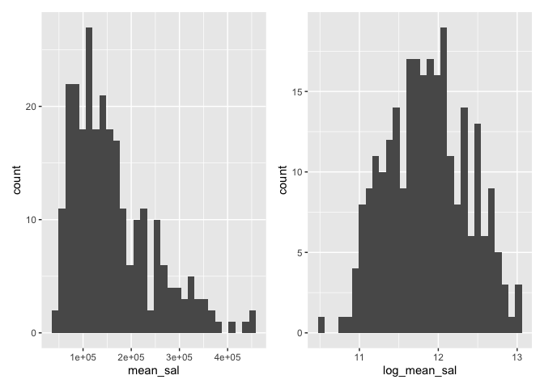
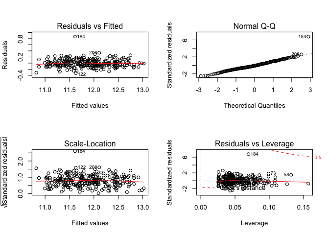
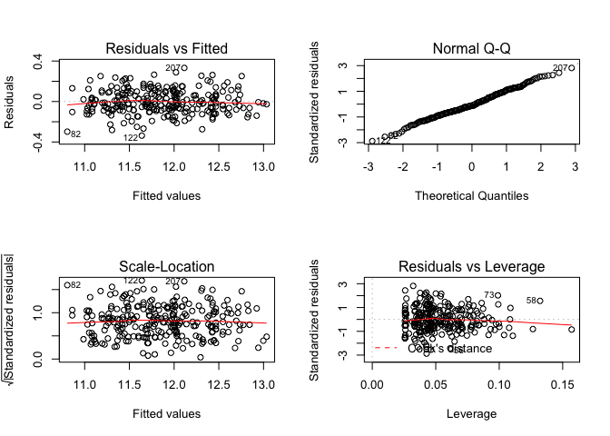

method\_draft
================
Ziqi Zhou
12/13/2019

# Method

Our dataset contains 7 factors that are potentially associated with the
salaries of the faculties. These are departure, gender, what they
emphasis(clinical or research), cert(borad certified or not certified),
publication rate(publications on CV/ years between CV date and MD date),
years since obtaining MD and rank. And the chose the mean of salary in
academic year 1994 and salary after increment to salary in academic year
1994 as our outcome. First, we drew plots to see the distribution of
outcome, and we found it was right skewed so we decided to make log
transformation. The distribution for the outcome are in
supplement(fig.1). After our literature reading, we assumed that the
gender was the main interested variable and put gender into the model.
Therefore, we had a pool of 7 variable candidates to build a model whose
purpose was find the association between the salary and some variables.

First, for the mean of salaries, we started with linear regression with
gender. Then we found that dept, clin, cert, prate and exper are
confounders and there was interaction between rank and gender. What’s
more, we found that there was high correlation between publication rate
and clin, so we decided to drop publication rate. We selected model
using the criterions-based procedures. What’s more we used residuals vs
fitted values plot, quantile-quantile plot, scale-location plot and
residuals vs leverage to diagnose model. We ended up with the linear
regression model concluding dept, clin, cert, exper, gender, rank and
the interaction term between gender and rank.

We used Cook’s distance, quantile-quantile plot, and residuals plots to
find whether there were any outliers that would impact our model
significantly. And we found that the 184th observation might be an
influential point, however, given the purpose of this analyses, we
decided to keep this
point.

|                                   | Females (N=106)                 | Males (N=155)                    | Total (N=261)                   |
| --------------------------------- | :------------------------------ | :------------------------------- | :------------------------------ |
| dept                              |                                 |                                  |                                 |
| \- Biochemistry/Molecular Biology | 20 (18.9%)                      | 30 (19.4%)                       | 50 (19.2%)                      |
| \- Physiology                     | 20 (18.9%)                      | 20 (12.9%)                       | 40 (15.3%)                      |
| \- Genetics                       | 11 (10.4%)                      | 10 (6.5%)                        | 21 (8.0%)                       |
| \- Pediatrics                     | 20 (18.9%)                      | 10 (6.5%)                        | 30 (11.5%)                      |
| \- Medicine                       | 30 (28.3%)                      | 50 (32.3%)                       | 80 (30.7%)                      |
| \- Surgery                        | 5 (4.7%)                        | 35 (22.6%)                       | 40 (15.3%)                      |
| clin                              |                                 |                                  |                                 |
| \- Primarily research emphasis    | 46 (43.4%)                      | 55 (35.5%)                       | 101 (38.7%)                     |
| \- Primarily clinical emphasis    | 60 (56.6%)                      | 100 (64.5%)                      | 160 (61.3%)                     |
| cert                              |                                 |                                  |                                 |
| \- Not Certified                  | 36 (34.0%)                      | 37 (23.9%)                       | 73 (28.0%)                      |
| \- Board Certified                | 70 (66.0%)                      | 118 (76.1%)                      | 188 (72.0%)                     |
| prate                             |                                 |                                  |                                 |
| \- Mean (SD)                      | 5.35 (1.89)                     | 4.65 (1.94)                      | 4.93 (1.94)                     |
| \- Median (Q1, Q3)                | 5.25 (3.73, 7.27)               | 4.00 (3.10, 6.70)                | 4.40 (3.20, 6.90)               |
| exper                             |                                 |                                  |                                 |
| \- Mean (SD)                      | 7.49 (4.17)                     | 12.10 (6.70)                     | 10.23 (6.23)                    |
| \- Median (Q1, Q3)                | 7.00 (5.00, 10.00)              | 10.00 (7.00, 15.00)              | 9.00 (6.00, 14.00)              |
| rank                              |                                 |                                  |                                 |
| \- Assistant                      | 69 (65.1%)                      | 43 (27.7%)                       | 112 (42.9%)                     |
| \- Associate                      | 21 (19.8%)                      | 43 (27.7%)                       | 64 (24.5%)                      |
| \- Full professor                 | 16 (15.1%)                      | 69 (44.5%)                       | 85 (32.6%)                      |
| sal94                             |                                 |                                  |                                 |
| \- Mean (SD)                      | 118871.27 (56168.01)            | 177338.76 (85930.54)             | 153593.34 (80469.67)            |
| \- Median (Q1, Q3)                | 108457.00 (75774.50, 143096.00) | 155006.00 (109687.00, 231501.50) | 133284.00 (90771.00, 200543.00) |
| sal95                             |                                 |                                  |                                 |
| \- Mean (SD)                      | 130876.92 (62034.51)            | 194914.09 (94902.73)             | 168906.66 (88778.43)            |
| \- Median (Q1, Q3)                | 119135.00 (82345.25, 154170.50) | 170967.00 (119952.50, 257163.00) | 148117.00 (99972.00, 218955.00) |

    ## `stat_bin()` using `bins = 30`. Pick better value with `binwidth`.
    ## `stat_bin()` using `bins = 30`. Pick better value with `binwidth`.

<!-- -->

## Final model

``` r
final_model= lm(log_mean_sal ~ dept + clin + cert + exper + gender*rank, data = data)
summary(final_model)
```

    ## 
    ## Call:
    ## lm(formula = log_mean_sal ~ dept + clin + cert + exper + gender * 
    ##     rank, data = data)
    ## 
    ## Residuals:
    ##      Min       1Q   Median       3Q      Max 
    ## -0.32667 -0.08080 -0.01075  0.07646  0.86686 
    ## 
    ## Coefficients:
    ##                                  Estimate Std. Error t value Pr(>|t|)    
    ## (Intercept)                     10.959335   0.027936 392.307  < 2e-16 ***
    ## deptPhysiology                  -0.175544   0.028871  -6.080 4.53e-09 ***
    ## deptGenetics                     0.184572   0.036206   5.098 6.84e-07 ***
    ## deptPediatrics                   0.208468   0.035528   5.868 1.41e-08 ***
    ## deptMedicine                     0.543204   0.029364  18.499  < 2e-16 ***
    ## deptSurgery                      0.931388   0.035267  26.409  < 2e-16 ***
    ## clinPrimarily clinical emphasis  0.197031   0.022175   8.885  < 2e-16 ***
    ## certBoard Certified              0.191213   0.021363   8.951  < 2e-16 ***
    ## exper                            0.018171   0.001806  10.064  < 2e-16 ***
    ## genderMales                      0.074479   0.027568   2.702  0.00738 ** 
    ## rankAssociate                    0.173142   0.033904   5.107 6.55e-07 ***
    ## rankFull professor               0.282281   0.039594   7.129 1.11e-11 ***
    ## genderMales:rankAssociate       -0.082943   0.044750  -1.853  0.06501 .  
    ## genderMales:rankFull professor  -0.105271   0.046654  -2.256  0.02492 *  
    ## ---
    ## Signif. codes:  0 '***' 0.001 '**' 0.01 '*' 0.05 '.' 0.1 ' ' 1
    ## 
    ## Residual standard error: 0.1325 on 247 degrees of freedom
    ## Multiple R-squared:  0.9355, Adjusted R-squared:  0.9322 
    ## F-statistic: 275.8 on 13 and 247 DF,  p-value: < 2.2e-16

``` r
par(mfrow=c(2,2))
plot(final_model)
```

<!-- -->

## Outliers and influ.point

Observation 184 is identified with high DFFITS value so it affects the
observation 184 fitted value. On the diagnostic plot, case 184 appears
problematic on each plot. Therefore, we try to remove this point and do
analysis again.

``` r
remove_184 = data[-c(184),]
remove.mod = lm(log_mean_sal ~ dept + clin + cert + exper + gender*rank, data=remove_184)
summary(remove.mod)
```

    ## 
    ## Call:
    ## lm(formula = log_mean_sal ~ dept + clin + cert + exper + gender * 
    ##     rank, data = remove_184)
    ## 
    ## Residuals:
    ##      Min       1Q   Median       3Q      Max 
    ## -0.33708 -0.07434 -0.01380  0.08434  0.33209 
    ## 
    ## Coefficients:
    ##                                  Estimate Std. Error t value Pr(>|t|)    
    ## (Intercept)                     10.949637   0.025286 433.035  < 2e-16 ***
    ## deptPhysiology                  -0.181193   0.026110  -6.940 3.46e-11 ***
    ## deptGenetics                     0.180068   0.032734   5.501 9.46e-08 ***
    ## deptPediatrics                   0.189702   0.032214   5.889 1.27e-08 ***
    ## deptMedicine                     0.515765   0.026795  19.249  < 2e-16 ***
    ## deptSurgery                      0.915461   0.031951  28.652  < 2e-16 ***
    ## clinPrimarily clinical emphasis  0.218278   0.020244  10.782  < 2e-16 ***
    ## certBoard Certified              0.207168   0.019428  10.663  < 2e-16 ***
    ## exper                            0.018590   0.001633  11.383  < 2e-16 ***
    ## genderMales                      0.045856   0.025211   1.819   0.0701 .  
    ## rankAssociate                    0.167412   0.030658   5.461 1.16e-07 ***
    ## rankFull professor               0.273861   0.035809   7.648 4.60e-13 ***
    ## genderMales:rankAssociate       -0.050384   0.040684  -1.238   0.2167    
    ## genderMales:rankFull professor  -0.077467   0.042336  -1.830   0.0685 .  
    ## ---
    ## Signif. codes:  0 '***' 0.001 '**' 0.01 '*' 0.05 '.' 0.1 ' ' 1
    ## 
    ## Residual standard error: 0.1198 on 246 degrees of freedom
    ## Multiple R-squared:  0.9472, Adjusted R-squared:  0.9445 
    ## F-statistic: 339.8 on 13 and 246 DF,  p-value: < 2.2e-16

``` r
par(mfrow=c(2,2))
plot(remove.mod)
```

<!-- -->
