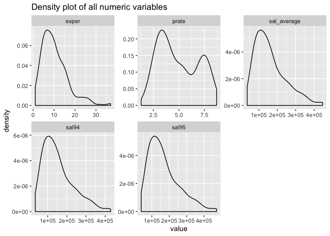
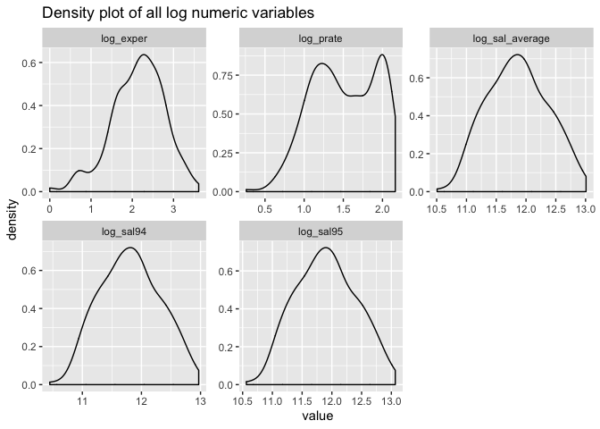
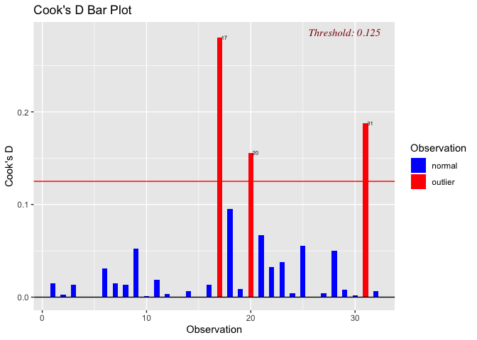

Qimin’s model building
================
Qimin Zhang
12/7/2019

``` r
data = read_csv("data/Lawsuit.csv") %>% 
  janitor::clean_names() %>% 
  dplyr::select(-id) %>% 
  mutate(dept = as.factor(dept),
         gender = as.factor(gender),
         clin = as.factor(clin),
         cert = as.factor(cert),
         rank = as.factor(rank))
```

Look at the distribution of all variables.

``` r
data %>%
  mutate(sal_average = (sal94 + sal95)/2) %>% 
  keep(is.numeric) %>%
  gather() %>% 
  ggplot(aes(value)) +
    facet_wrap(~ key, scales = "free") +
    geom_density() +
    labs(
    title = "Density plot of all numeric variables"
  )
```

<!-- -->

We can see that they are all not normal. Let’s try log transformation.

``` r
data %>%
  mutate(sal_average = (sal94 + sal95)/2) %>%
  mutate(
    log_exper = log(exper),
    log_prate = log(prate),
    log_sal_average = log(sal_average),
    log_sal94 = log(sal94),
    log_sal95 = log(sal95)
  ) %>% 
  dplyr::select(-exper, -prate, -sal_average, -sal94, -sal95) %>% 
  keep(is.numeric) %>%
  gather() %>% 
  ggplot(aes(value)) +
    facet_wrap(~ key, scales = "free") +
    geom_density() +
    labs(
    title = "Density plot of all log numeric variables"
  )
```

<!-- -->

The salaries and exper seem to be normal, while prate is still not
normal.

Fit model with sal\_average as
response.

``` r
lm(log(sal_average) ~ . , data = data %>% mutate(sal_average = (sal94 + sal95)/2) %>% dplyr::select(-sal94, -sal95)) %>% 
  step(direction='backward') %>% 
  summary()
```

    ## Start:  AIC=-1038.3
    ## log(sal_average) ~ dept + gender + clin + cert + prate + exper + 
    ##     rank
    ## 
    ##          Df Sum of Sq     RSS      AIC
    ## - gender  1    0.0166  4.4393 -1039.32
    ## - prate   1    0.0279  4.4506 -1038.66
    ## <none>                 4.4226 -1038.30
    ## - clin    1    0.2858  4.7085 -1023.96
    ## - rank    2    1.2646  5.6872  -976.66
    ## - cert    1    1.4402  5.8628  -966.73
    ## - exper   1    1.7384  6.1610  -953.78
    ## - dept    5    9.1712 13.5938  -755.23
    ## 
    ## Step:  AIC=-1039.32
    ## log(sal_average) ~ dept + clin + cert + prate + exper + rank
    ## 
    ##         Df Sum of Sq     RSS      AIC
    ## <none>                4.4393 -1039.32
    ## - prate  1    0.0421  4.4814 -1038.86
    ## - clin   1    0.2695  4.7088 -1025.94
    ## - rank   2    1.3973  5.8366  -971.90
    ## - cert   1    1.4549  5.8942  -967.33
    ## - exper  1    1.8444  6.2837  -950.63
    ## - dept   5    9.3583 13.7976  -753.35

    ## 
    ## Call:
    ## lm(formula = log(sal_average) ~ dept + clin + cert + prate + 
    ##     exper + rank, data = data %>% mutate(sal_average = (sal94 + 
    ##     sal95)/2) %>% dplyr::select(-sal94, -sal95))
    ## 
    ## Residuals:
    ##      Min       1Q   Median       3Q      Max 
    ## -0.34228 -0.08136 -0.01292  0.08004  0.90901 
    ## 
    ## Coefficients:
    ##              Estimate Std. Error t value Pr(>|t|)    
    ## (Intercept) 11.176162   0.129693  86.174  < 2e-16 ***
    ## dept2       -0.176674   0.029061  -6.079 4.51e-09 ***
    ## dept3        0.165536   0.038580   4.291 2.55e-05 ***
    ## dept4        0.141486   0.052228   2.709  0.00722 ** 
    ## dept5        0.490294   0.044850  10.932  < 2e-16 ***
    ## dept6        0.865105   0.061350  14.101  < 2e-16 ***
    ## clin1        0.156395   0.040226   3.888  0.00013 ***
    ## cert1        0.191677   0.021218   9.034  < 2e-16 ***
    ## prate       -0.025859   0.016831  -1.536  0.12571    
    ## exper        0.018316   0.001801  10.171  < 2e-16 ***
    ## rank2        0.136661   0.023193   5.892 1.23e-08 ***
    ## rank3        0.224767   0.025719   8.739 3.53e-16 ***
    ## ---
    ## Signif. codes:  0 '***' 0.001 '**' 0.01 '*' 0.05 '.' 0.1 ' ' 1
    ## 
    ## Residual standard error: 0.1335 on 249 degrees of freedom
    ## Multiple R-squared:  0.9341, Adjusted R-squared:  0.9311 
    ## F-statistic: 320.6 on 11 and 249 DF,  p-value: < 2.2e-16

Fit model with sal94 as response.

``` r
lm(log(sal94) ~ . , data = data  %>% dplyr::select(-sal95)) %>% 
  step(direction='backward') %>% 
  summary()
```

    ## Start:  AIC=-1037.13
    ## log(sal94) ~ dept + gender + clin + cert + prate + exper + rank
    ## 
    ##          Df Sum of Sq     RSS      AIC
    ## - gender  1    0.0190  4.4615 -1038.02
    ## - prate   1    0.0288  4.4713 -1037.45
    ## <none>                 4.4425 -1037.13
    ## - clin    1    0.2719  4.7143 -1023.63
    ## - rank    2    1.2528  5.6952  -976.30
    ## - cert    1    1.4736  5.9161  -964.37
    ## - exper   1    1.7301  6.1726  -953.29
    ## - dept    5    9.2120 13.6544  -754.07
    ## 
    ## Step:  AIC=-1038.02
    ## log(sal94) ~ dept + clin + cert + prate + exper + rank
    ## 
    ##         Df Sum of Sq     RSS      AIC
    ## <none>                4.4615 -1038.02
    ## - prate  1    0.0441  4.5056 -1037.45
    ## - clin   1    0.2537  4.7152 -1025.58
    ## - rank   2    1.3891  5.8506  -971.27
    ## - cert   1    1.4895  5.9510  -964.83
    ## - exper  1    1.8398  6.3013  -949.90
    ## - dept   5    9.4082 13.8697  -751.99

    ## 
    ## Call:
    ## lm(formula = log(sal94) ~ dept + clin + cert + prate + exper + 
    ##     rank, data = data %>% dplyr::select(-sal95))
    ## 
    ## Residuals:
    ##      Min       1Q   Median       3Q      Max 
    ## -0.35367 -0.08193 -0.01482  0.08201  0.90388 
    ## 
    ## Coefficients:
    ##              Estimate Std. Error t value Pr(>|t|)    
    ## (Intercept) 11.134329   0.130017  85.638  < 2e-16 ***
    ## dept2       -0.177429   0.029134  -6.090 4.25e-09 ***
    ## dept3        0.166082   0.038676   4.294 2.51e-05 ***
    ## dept4        0.135920   0.052358   2.596 0.009993 ** 
    ## dept5        0.489498   0.044962  10.887  < 2e-16 ***
    ## dept6        0.861483   0.061503  14.007  < 2e-16 ***
    ## clin1        0.151748   0.040326   3.763 0.000209 ***
    ## cert1        0.193940   0.021271   9.118  < 2e-16 ***
    ## prate       -0.026486   0.016873  -1.570 0.117748    
    ## exper        0.018293   0.001805  10.133  < 2e-16 ***
    ## rank2        0.135514   0.023251   5.828 1.73e-08 ***
    ## rank3        0.224279   0.025783   8.699 4.65e-16 ***
    ## ---
    ## Signif. codes:  0 '***' 0.001 '**' 0.01 '*' 0.05 '.' 0.1 ' ' 1
    ## 
    ## Residual standard error: 0.1339 on 249 degrees of freedom
    ## Multiple R-squared:  0.9336, Adjusted R-squared:  0.9306 
    ## F-statistic: 318.1 on 11 and 249 DF,  p-value: < 2.2e-16

Fit model with sal95 as response.

``` r
lm(log(sal95) ~ . , data = data  %>% dplyr::select(-sal94)) %>% 
  step(direction='backward') %>% 
  summary()
```

    ## Start:  AIC=-1037.02
    ## log(sal95) ~ dept + gender + clin + cert + prate + exper + rank
    ## 
    ##          Df Sum of Sq     RSS      AIC
    ## - gender  1    0.0146  4.4591 -1038.16
    ## - prate   1    0.0271  4.4716 -1037.43
    ## <none>                 4.4445 -1037.02
    ## - clin    1    0.2988  4.7433 -1022.03
    ## - rank    2    1.2755  5.7200  -975.16
    ## - cert    1    1.4102  5.8547  -967.09
    ## - exper   1    1.7458  6.1903  -952.54
    ## - dept    5    9.1351 13.5795  -755.50
    ## 
    ## Step:  AIC=-1038.16
    ## log(sal95) ~ dept + clin + cert + prate + exper + rank
    ## 
    ##         Df Sum of Sq     RSS      AIC
    ## <none>                4.4591 -1038.16
    ## - prate  1    0.0403  4.4994 -1037.81
    ## - clin   1    0.2842  4.7434 -1024.03
    ## - rank   2    1.4050  5.8641  -970.67
    ## - cert   1    1.4240  5.8831  -967.83
    ## - exper  1    1.8485  6.3076  -949.64
    ## - dept   5    9.3142 13.7733  -753.81

    ## 
    ## Call:
    ## lm(formula = log(sal95) ~ dept + clin + cert + prate + exper + 
    ##     rank, data = data %>% dplyr::select(-sal94))
    ## 
    ## Residuals:
    ##      Min       1Q   Median       3Q      Max 
    ## -0.33188 -0.08211 -0.00854  0.08089  0.91375 
    ## 
    ## Coefficients:
    ##              Estimate Std. Error t value Pr(>|t|)    
    ## (Intercept) 11.216272   0.129982  86.291  < 2e-16 ***
    ## dept2       -0.176026   0.029126  -6.044 5.47e-09 ***
    ## dept3        0.165036   0.038666   4.268 2.80e-05 ***
    ## dept4        0.146569   0.052344   2.800  0.00551 ** 
    ## dept5        0.491025   0.044950  10.924  < 2e-16 ***
    ## dept6        0.868405   0.061487  14.123  < 2e-16 ***
    ## clin1        0.160616   0.040315   3.984 8.90e-05 ***
    ## cert1        0.189629   0.021265   8.917  < 2e-16 ***
    ## prate       -0.025290   0.016868  -1.499  0.13508    
    ## exper        0.018336   0.001805  10.160  < 2e-16 ***
    ## rank2        0.137742   0.023245   5.926 1.03e-08 ***
    ## rank3        0.225212   0.025776   8.737 3.58e-16 ***
    ## ---
    ## Signif. codes:  0 '***' 0.001 '**' 0.01 '*' 0.05 '.' 0.1 ' ' 1
    ## 
    ## Residual standard error: 0.1338 on 249 degrees of freedom
    ## Multiple R-squared:  0.9339, Adjusted R-squared:  0.931 
    ## F-statistic:   320 on 11 and 249 DF,  p-value: < 2.2e-16

Check if gender is a confounder for these
variables.

``` r
lm(formula = log(sal_average) ~ dept, data = data %>% mutate(sal_average = (sal94 + 
    sal95)/2) %>% dplyr::select(-sal94, -sal95)) %>% 
  summary()
```

    ## 
    ## Call:
    ## lm(formula = log(sal_average) ~ dept, data = data %>% mutate(sal_average = (sal94 + 
    ##     sal95)/2) %>% dplyr::select(-sal94, -sal95))
    ## 
    ## Residuals:
    ##      Min       1Q   Median       3Q      Max 
    ## -0.80805 -0.19746 -0.01447  0.17784  0.60079 
    ## 
    ## Coefficients:
    ##             Estimate Std. Error t value Pr(>|t|)    
    ## (Intercept) 11.46816    0.03830 299.391  < 2e-16 ***
    ## dept2       -0.15246    0.05746  -2.654  0.00847 ** 
    ## dept3        0.17552    0.07043   2.492  0.01334 *  
    ## dept4        0.25063    0.06255   4.007 8.09e-05 ***
    ## dept5        0.65456    0.04883  13.405  < 2e-16 ***
    ## dept6        1.13311    0.05746  19.721  < 2e-16 ***
    ## ---
    ## Signif. codes:  0 '***' 0.001 '**' 0.01 '*' 0.05 '.' 0.1 ' ' 1
    ## 
    ## Residual standard error: 0.2709 on 255 degrees of freedom
    ## Multiple R-squared:  0.7221, Adjusted R-squared:  0.7166 
    ## F-statistic: 132.5 on 5 and 255 DF,  p-value: < 2.2e-16

``` r
lm(formula = log(sal_average) ~ dept + gender, data = data %>% mutate(sal_average = (sal94 + 
    sal95)/2) %>% dplyr::select(-sal94, -sal95)) %>% 
  summary()
```

    ## 
    ## Call:
    ## lm(formula = log(sal_average) ~ dept + gender, data = data %>% 
    ##     mutate(sal_average = (sal94 + sal95)/2) %>% dplyr::select(-sal94, 
    ##     -sal95))
    ## 
    ## Residuals:
    ##      Min       1Q   Median       3Q      Max 
    ## -0.70544 -0.19433 -0.02501  0.16341  0.60779 
    ## 
    ## Coefficients:
    ##             Estimate Std. Error t value Pr(>|t|)    
    ## (Intercept) 11.34504    0.04110 276.036  < 2e-16 ***
    ## dept2       -0.13194    0.05385  -2.450  0.01496 *  
    ## dept3        0.20092    0.06602   3.044  0.00258 ** 
    ## dept4        0.30535    0.05919   5.158 5.02e-07 ***
    ## dept5        0.64943    0.04569  14.215  < 2e-16 ***
    ## dept6        1.07668    0.05453  19.743  < 2e-16 ***
    ## gender1      0.20521    0.03355   6.116 3.60e-09 ***
    ## ---
    ## Signif. codes:  0 '***' 0.001 '**' 0.01 '*' 0.05 '.' 0.1 ' ' 1
    ## 
    ## Residual standard error: 0.2534 on 254 degrees of freedom
    ## Multiple R-squared:  0.7578, Adjusted R-squared:  0.752 
    ## F-statistic: 132.4 on 6 and 254 DF,  p-value: < 2.2e-16

``` r
lm(formula = log(sal_average) ~ clin, data = data %>% mutate(sal_average = (sal94 + 
    sal95)/2) %>% dplyr::select(-sal94, -sal95)) %>% 
  summary()
```

    ## 
    ## Call:
    ## lm(formula = log(sal_average) ~ clin, data = data %>% mutate(sal_average = (sal94 + 
    ##     sal95)/2) %>% dplyr::select(-sal94, -sal95))
    ## 
    ## Residuals:
    ##      Min       1Q   Median       3Q      Max 
    ## -1.21095 -0.28926 -0.03199  0.24614  1.08719 
    ## 
    ## Coefficients:
    ##             Estimate Std. Error t value Pr(>|t|)    
    ## (Intercept) 11.47255    0.04022  285.21   <2e-16 ***
    ## clin1        0.63532    0.05137   12.37   <2e-16 ***
    ## ---
    ## Signif. codes:  0 '***' 0.001 '**' 0.01 '*' 0.05 '.' 0.1 ' ' 1
    ## 
    ## Residual standard error: 0.4043 on 259 degrees of freedom
    ## Multiple R-squared:  0.3712, Adjusted R-squared:  0.3688 
    ## F-statistic: 152.9 on 1 and 259 DF,  p-value: < 2.2e-16

``` r
lm(formula = log(sal_average) ~ clin + gender, data = data %>% mutate(sal_average = (sal94 + 
    sal95)/2) %>% dplyr::select(-sal94, -sal95)) %>% 
  summary()
```

    ## 
    ## Call:
    ## lm(formula = log(sal_average) ~ clin + gender, data = data %>% 
    ##     mutate(sal_average = (sal94 + sal95)/2) %>% dplyr::select(-sal94, 
    ##     -sal95))
    ## 
    ## Residuals:
    ##      Min       1Q   Median       3Q      Max 
    ## -1.00911 -0.25023 -0.01895  0.24564  0.99426 
    ## 
    ## Coefficients:
    ##             Estimate Std. Error t value Pr(>|t|)    
    ## (Intercept) 11.28894    0.04470 252.526  < 2e-16 ***
    ## clin1        0.60819    0.04710  12.912  < 2e-16 ***
    ## gender1      0.33718    0.04671   7.218 5.89e-12 ***
    ## ---
    ## Signif. codes:  0 '***' 0.001 '**' 0.01 '*' 0.05 '.' 0.1 ' ' 1
    ## 
    ## Residual standard error: 0.3694 on 258 degrees of freedom
    ## Multiple R-squared:  0.4769, Adjusted R-squared:  0.4728 
    ## F-statistic: 117.6 on 2 and 258 DF,  p-value: < 2.2e-16

``` r
lm(formula = log(sal_average) ~ cert, data = data %>% mutate(sal_average = (sal94 + 
    sal95)/2) %>% dplyr::select(-sal94, -sal95)) %>% 
  summary()
```

    ## 
    ## Call:
    ## lm(formula = log(sal_average) ~ cert, data = data %>% mutate(sal_average = (sal94 + 
    ##     sal95)/2) %>% dplyr::select(-sal94, -sal95))
    ## 
    ## Residuals:
    ##      Min       1Q   Median       3Q      Max 
    ## -1.09644 -0.29897 -0.03507  0.30039  1.18356 
    ## 
    ## Coefficients:
    ##             Estimate Std. Error t value Pr(>|t|)    
    ## (Intercept) 11.45863    0.05185 221.007   <2e-16 ***
    ## cert1        0.56003    0.06109   9.167   <2e-16 ***
    ## ---
    ## Signif. codes:  0 '***' 0.001 '**' 0.01 '*' 0.05 '.' 0.1 ' ' 1
    ## 
    ## Residual standard error: 0.443 on 259 degrees of freedom
    ## Multiple R-squared:  0.245,  Adjusted R-squared:  0.2421 
    ## F-statistic: 84.04 on 1 and 259 DF,  p-value: < 2.2e-16

``` r
lm(formula = log(sal_average) ~ cert + gender, data = data %>% mutate(sal_average = (sal94 + 
    sal95)/2) %>% dplyr::select(-sal94, -sal95)) %>% 
  summary()
```

    ## 
    ## Call:
    ## lm(formula = log(sal_average) ~ cert + gender, data = data %>% 
    ##     mutate(sal_average = (sal94 + sal95)/2) %>% dplyr::select(-sal94, 
    ##     -sal95))
    ## 
    ## Residuals:
    ##      Min       1Q   Median       3Q      Max 
    ## -1.11866 -0.27669 -0.01921  0.31081  1.01942 
    ## 
    ## Coefficients:
    ##             Estimate Std. Error t value Pr(>|t|)    
    ## (Intercept) 11.28992    0.05510 204.888  < 2e-16 ***
    ## cert1        0.51981    0.05726   9.078  < 2e-16 ***
    ## gender1      0.33285    0.05233   6.360 9.11e-10 ***
    ## ---
    ## Signif. codes:  0 '***' 0.001 '**' 0.01 '*' 0.05 '.' 0.1 ' ' 1
    ## 
    ## Residual standard error: 0.4127 on 258 degrees of freedom
    ## Multiple R-squared:  0.3473, Adjusted R-squared:  0.3423 
    ## F-statistic: 68.65 on 2 and 258 DF,  p-value: < 2.2e-16

``` r
lm(formula = log(sal_average) ~ prate, data = data %>% mutate(sal_average = (sal94 + 
    sal95)/2) %>% dplyr::select(-sal94, -sal95)) %>% 
  summary()
```

    ## 
    ## Call:
    ## lm(formula = log(sal_average) ~ prate, data = data %>% mutate(sal_average = (sal94 + 
    ##     sal95)/2) %>% dplyr::select(-sal94, -sal95))
    ## 
    ## Residuals:
    ##      Min       1Q   Median       3Q      Max 
    ## -0.95146 -0.22965  0.01694  0.23879  0.87759 
    ## 
    ## Coefficients:
    ##             Estimate Std. Error t value Pr(>|t|)    
    ## (Intercept) 12.85380    0.05515  233.06   <2e-16 ***
    ## prate       -0.20108    0.01041  -19.32   <2e-16 ***
    ## ---
    ## Signif. codes:  0 '***' 0.001 '**' 0.01 '*' 0.05 '.' 0.1 ' ' 1
    ## 
    ## Residual standard error: 0.3263 on 259 degrees of freedom
    ## Multiple R-squared:  0.5905, Adjusted R-squared:  0.5889 
    ## F-statistic: 373.4 on 1 and 259 DF,  p-value: < 2.2e-16

``` r
lm(formula = log(sal_average) ~ prate + gender, data = data %>% mutate(sal_average = (sal94 + 
    sal95)/2) %>% dplyr::select(-sal94, -sal95)) %>% 
  summary()
```

    ## 
    ## Call:
    ## lm(formula = log(sal_average) ~ prate + gender, data = data %>% 
    ##     mutate(sal_average = (sal94 + sal95)/2) %>% dplyr::select(-sal94, 
    ##     -sal95))
    ## 
    ## Residuals:
    ##     Min      1Q  Median      3Q     Max 
    ## -0.8027 -0.1953  0.0039  0.1925  0.7354 
    ## 
    ## Coefficients:
    ##              Estimate Std. Error t value Pr(>|t|)    
    ## (Intercept) 12.648300   0.060244 209.951  < 2e-16 ***
    ## prate       -0.189739   0.009824 -19.313  < 2e-16 ***
    ## gender1      0.251814   0.038823   6.486 4.46e-10 ***
    ## ---
    ## Signif. codes:  0 '***' 0.001 '**' 0.01 '*' 0.05 '.' 0.1 ' ' 1
    ## 
    ## Residual standard error: 0.3031 on 258 degrees of freedom
    ## Multiple R-squared:  0.6479, Adjusted R-squared:  0.6452 
    ## F-statistic: 237.4 on 2 and 258 DF,  p-value: < 2.2e-16

``` r
lm(formula = log(sal_average) ~ exper, data = data %>% mutate(sal_average = (sal94 + 
    sal95)/2) %>% dplyr::select(-sal94, -sal95)) %>% 
  summary()
```

    ## 
    ## Call:
    ## lm(formula = log(sal_average) ~ exper, data = data %>% mutate(sal_average = (sal94 + 
    ##     sal95)/2) %>% dplyr::select(-sal94, -sal95))
    ## 
    ## Residuals:
    ##      Min       1Q   Median       3Q      Max 
    ## -1.14274 -0.40136  0.04665  0.36561  1.09967 
    ## 
    ## Coefficients:
    ##              Estimate Std. Error t value Pr(>|t|)    
    ## (Intercept) 11.598960   0.057687 201.067  < 2e-16 ***
    ## exper        0.025714   0.004819   5.336 2.08e-07 ***
    ## ---
    ## Signif. codes:  0 '***' 0.001 '**' 0.01 '*' 0.05 '.' 0.1 ' ' 1
    ## 
    ## Residual standard error: 0.4839 on 259 degrees of freedom
    ## Multiple R-squared:  0.09903,    Adjusted R-squared:  0.09556 
    ## F-statistic: 28.47 on 1 and 259 DF,  p-value: 2.078e-07

``` r
lm(formula = log(sal_average) ~ exper + gender, data = data %>% mutate(sal_average = (sal94 + 
    sal95)/2) %>% dplyr::select(-sal94, -sal95)) %>% 
  summary()
```

    ## 
    ## Call:
    ## lm(formula = log(sal_average) ~ exper + gender, data = data %>% 
    ##     mutate(sal_average = (sal94 + sal95)/2) %>% dplyr::select(-sal94, 
    ##     -sal95))
    ## 
    ## Residuals:
    ##      Min       1Q   Median       3Q      Max 
    ## -1.03299 -0.37372  0.04036  0.33276  1.02947 
    ## 
    ## Coefficients:
    ##             Estimate Std. Error t value Pr(>|t|)    
    ## (Intercept) 11.50693    0.05839 197.079  < 2e-16 ***
    ## exper        0.01686    0.00496   3.399 0.000784 ***
    ## gender1      0.30755    0.06277   4.900  1.7e-06 ***
    ## ---
    ## Signif. codes:  0 '***' 0.001 '**' 0.01 '*' 0.05 '.' 0.1 ' ' 1
    ## 
    ## Residual standard error: 0.4637 on 258 degrees of freedom
    ## Multiple R-squared:  0.1757, Adjusted R-squared:  0.1693 
    ## F-statistic:  27.5 on 2 and 258 DF,  p-value: 1.488e-11

``` r
lm(formula = log(sal_average) ~ rank, data = data %>% mutate(sal_average = (sal94 + 
    sal95)/2) %>% dplyr::select(-sal94, -sal95)) %>% 
  summary()
```

    ## 
    ## Call:
    ## lm(formula = log(sal_average) ~ rank, data = data %>% mutate(sal_average = (sal94 + 
    ##     sal95)/2) %>% dplyr::select(-sal94, -sal95))
    ## 
    ## Residuals:
    ##      Min       1Q   Median       3Q      Max 
    ## -1.24216 -0.39632 -0.01269  0.34486  1.03643 
    ## 
    ## Coefficients:
    ##             Estimate Std. Error t value Pr(>|t|)    
    ## (Intercept) 11.74981    0.04695 250.256  < 2e-16 ***
    ## rank2        0.09541    0.07786   1.225  0.22155    
    ## rank3        0.27269    0.07148   3.815  0.00017 ***
    ## ---
    ## Signif. codes:  0 '***' 0.001 '**' 0.01 '*' 0.05 '.' 0.1 ' ' 1
    ## 
    ## Residual standard error: 0.4969 on 258 degrees of freedom
    ## Multiple R-squared:  0.05374,    Adjusted R-squared:  0.0464 
    ## F-statistic: 7.326 on 2 and 258 DF,  p-value: 0.0008047

``` r
lm(formula = log(sal_average) ~ rank + gender, data = data %>% mutate(sal_average = (sal94 + 
    sal95)/2) %>% dplyr::select(-sal94, -sal95)) %>% 
  summary()
```

    ## 
    ## Call:
    ## lm(formula = log(sal_average) ~ rank + gender, data = data %>% 
    ##     mutate(sal_average = (sal94 + sal95)/2) %>% dplyr::select(-sal94, 
    ##     -sal95))
    ## 
    ## Residuals:
    ##      Min       1Q   Median       3Q      Max 
    ## -1.10798 -0.37872  0.01491  0.35397  1.03532 
    ## 
    ## Coefficients:
    ##              Estimate Std. Error t value Pr(>|t|)    
    ## (Intercept) 11.615638   0.050964 227.919  < 2e-16 ***
    ## rank2       -0.005225   0.076187  -0.069   0.9454    
    ## rank3        0.123166   0.073223   1.682   0.0938 .  
    ## gender1      0.349481   0.064420   5.425 1.34e-07 ***
    ## ---
    ## Signif. codes:  0 '***' 0.001 '**' 0.01 '*' 0.05 '.' 0.1 ' ' 1
    ## 
    ## Residual standard error: 0.4716 on 257 degrees of freedom
    ## Multiple R-squared:  0.151,  Adjusted R-squared:  0.1411 
    ## F-statistic: 15.23 on 3 and 257 DF,  p-value: 3.747e-09

So the dept, exp and rank are confounded by the
gender.

``` r
lm(log(sal_average) ~ (dept + clin + cert + exper + rank)*gender, data = data %>% mutate(sal_average = (sal94 + sal95)/2) %>% dplyr::select(-sal94, -sal95)) %>% 
  summary()
```

    ## 
    ## Call:
    ## lm(formula = log(sal_average) ~ (dept + clin + cert + exper + 
    ##     rank) * gender, data = data %>% mutate(sal_average = (sal94 + 
    ##     sal95)/2) %>% dplyr::select(-sal94, -sal95))
    ## 
    ## Residuals:
    ##      Min       1Q   Median       3Q      Max 
    ## -0.32722 -0.07580 -0.00848  0.07071  0.83916 
    ## 
    ## Coefficients:
    ##                Estimate Std. Error t value Pr(>|t|)    
    ## (Intercept)   10.910077   0.047435 230.000  < 2e-16 ***
    ## dept2         -0.200083   0.044177  -4.529 9.35e-06 ***
    ## dept3          0.149171   0.051446   2.900 0.004085 ** 
    ## dept4          0.202252   0.051497   3.927 0.000112 ***
    ## dept5          0.537308   0.047515  11.308  < 2e-16 ***
    ## dept6          0.922282   0.075863  12.157  < 2e-16 ***
    ## clin1          0.237856   0.032668   7.281 4.76e-12 ***
    ## cert1          0.169028   0.034541   4.894 1.82e-06 ***
    ## exper          0.027516   0.004671   5.891 1.29e-08 ***
    ## rank2          0.141944   0.037446   3.791 0.000190 ***
    ## rank3          0.206462   0.052104   3.962 9.80e-05 ***
    ## gender1        0.129289   0.060919   2.122 0.034841 *  
    ## dept2:gender1  0.066863   0.058967   1.134 0.257971    
    ## dept3:gender1  0.093732   0.073790   1.270 0.205233    
    ## dept4:gender1  0.035246   0.074211   0.475 0.635259    
    ## dept5:gender1  0.031015   0.060957   0.509 0.611364    
    ## dept6:gender1  0.047254   0.087272   0.541 0.588698    
    ## clin1:gender1 -0.071685   0.045751  -1.567 0.118469    
    ## cert1:gender1  0.021934   0.045048   0.487 0.626765    
    ## exper:gender1 -0.010832   0.005076  -2.134 0.033875 *  
    ## rank2:gender1 -0.048680   0.049397  -0.985 0.325388    
    ## rank3:gender1 -0.020744   0.062122  -0.334 0.738730    
    ## ---
    ## Signif. codes:  0 '***' 0.001 '**' 0.01 '*' 0.05 '.' 0.1 ' ' 1
    ## 
    ## Residual standard error: 0.1321 on 239 degrees of freedom
    ## Multiple R-squared:  0.9381, Adjusted R-squared:  0.9326 
    ## F-statistic: 172.4 on 21 and 239 DF,  p-value: < 2.2e-16

``` r
lm(log(sal_average) ~ dept + clin + cert + exper + rank + gender + gender*exper, data = data %>% mutate(sal_average = (sal94 + sal95)/2) %>% dplyr::select(-sal94, -sal95)) %>% 
  summary()
```

    ## 
    ## Call:
    ## lm(formula = log(sal_average) ~ dept + clin + cert + exper + 
    ##     rank + gender + gender * exper, data = data %>% mutate(sal_average = (sal94 + 
    ##     sal95)/2) %>% dplyr::select(-sal94, -sal95))
    ## 
    ## Residuals:
    ##      Min       1Q   Median       3Q      Max 
    ## -0.32130 -0.07860 -0.00987  0.07100  0.86910 
    ## 
    ## Coefficients:
    ##                Estimate Std. Error t value Pr(>|t|)    
    ## (Intercept)   10.903325   0.034805 313.272  < 2e-16 ***
    ## dept2         -0.165069   0.028755  -5.741 2.75e-08 ***
    ## dept3          0.189770   0.035827   5.297 2.60e-07 ***
    ## dept4          0.218603   0.035342   6.185 2.54e-09 ***
    ## dept5          0.546771   0.029045  18.825  < 2e-16 ***
    ## dept6          0.939830   0.034907  26.924  < 2e-16 ***
    ## clin1          0.208175   0.021470   9.696  < 2e-16 ***
    ## cert1          0.182166   0.020969   8.688 5.09e-16 ***
    ## exper          0.027774   0.003545   7.834 1.38e-13 ***
    ## rank2          0.118231   0.023648   5.000 1.09e-06 ***
    ## rank3          0.208036   0.026112   7.967 5.90e-14 ***
    ## gender1        0.128932   0.036912   3.493 0.000566 ***
    ## exper:gender1 -0.011728   0.003580  -3.276 0.001204 ** 
    ## ---
    ## Signif. codes:  0 '***' 0.001 '**' 0.01 '*' 0.05 '.' 0.1 ' ' 1
    ## 
    ## Residual standard error: 0.1312 on 248 degrees of freedom
    ## Multiple R-squared:  0.9366, Adjusted R-squared:  0.9336 
    ## F-statistic: 305.4 on 12 and 248 DF,  p-value: < 2.2e-16

# After Cody’s office hour

``` r
lm(log(sal_average) ~ gender, data = data %>% mutate(sal_average = (sal94 + sal95)/2) %>% dplyr::select(-sal94, -sal95)) %>% 
  summary()
```

    ## 
    ## Call:
    ## lm(formula = log(sal_average) ~ gender, data = data %>% mutate(sal_average = (sal94 + 
    ##     sal95)/2) %>% dplyr::select(-sal94, -sal95))
    ## 
    ## Residuals:
    ##     Min      1Q  Median      3Q     Max 
    ## -1.1255 -0.3659 -0.0078  0.3342  1.0549 
    ## 
    ## Coefficients:
    ##             Estimate Std. Error t value Pr(>|t|)    
    ## (Intercept) 11.63319    0.04595 253.162  < 2e-16 ***
    ## gender1      0.38530    0.05963   6.462  5.1e-10 ***
    ## ---
    ## Signif. codes:  0 '***' 0.001 '**' 0.01 '*' 0.05 '.' 0.1 ' ' 1
    ## 
    ## Residual standard error: 0.4731 on 259 degrees of freedom
    ## Multiple R-squared:  0.1388, Adjusted R-squared:  0.1355 
    ## F-statistic: 41.75 on 1 and 259 DF,  p-value: 5.103e-10

``` r
lm(log(sal_average) ~ gender + dept, data = data %>% mutate(sal_average = (sal94 + sal95)/2) %>% dplyr::select(-sal94, -sal95)) %>% 
  summary()
```

    ## 
    ## Call:
    ## lm(formula = log(sal_average) ~ gender + dept, data = data %>% 
    ##     mutate(sal_average = (sal94 + sal95)/2) %>% dplyr::select(-sal94, 
    ##     -sal95))
    ## 
    ## Residuals:
    ##      Min       1Q   Median       3Q      Max 
    ## -0.70544 -0.19433 -0.02501  0.16341  0.60779 
    ## 
    ## Coefficients:
    ##             Estimate Std. Error t value Pr(>|t|)    
    ## (Intercept) 11.34504    0.04110 276.036  < 2e-16 ***
    ## gender1      0.20521    0.03355   6.116 3.60e-09 ***
    ## dept2       -0.13194    0.05385  -2.450  0.01496 *  
    ## dept3        0.20092    0.06602   3.044  0.00258 ** 
    ## dept4        0.30535    0.05919   5.158 5.02e-07 ***
    ## dept5        0.64943    0.04569  14.215  < 2e-16 ***
    ## dept6        1.07668    0.05453  19.743  < 2e-16 ***
    ## ---
    ## Signif. codes:  0 '***' 0.001 '**' 0.01 '*' 0.05 '.' 0.1 ' ' 1
    ## 
    ## Residual standard error: 0.2534 on 254 degrees of freedom
    ## Multiple R-squared:  0.7578, Adjusted R-squared:  0.752 
    ## F-statistic: 132.4 on 6 and 254 DF,  p-value: < 2.2e-16

So department is a confounder of the association between salary and
gender.

``` r
lm(log(sal_average) ~ gender + clin, data = data %>% mutate(sal_average = (sal94 + sal95)/2) %>% dplyr::select(-sal94, -sal95)) %>% 
  summary()
```

    ## 
    ## Call:
    ## lm(formula = log(sal_average) ~ gender + clin, data = data %>% 
    ##     mutate(sal_average = (sal94 + sal95)/2) %>% dplyr::select(-sal94, 
    ##     -sal95))
    ## 
    ## Residuals:
    ##      Min       1Q   Median       3Q      Max 
    ## -1.00911 -0.25023 -0.01895  0.24564  0.99426 
    ## 
    ## Coefficients:
    ##             Estimate Std. Error t value Pr(>|t|)    
    ## (Intercept) 11.28894    0.04470 252.526  < 2e-16 ***
    ## gender1      0.33718    0.04671   7.218 5.89e-12 ***
    ## clin1        0.60819    0.04710  12.912  < 2e-16 ***
    ## ---
    ## Signif. codes:  0 '***' 0.001 '**' 0.01 '*' 0.05 '.' 0.1 ' ' 1
    ## 
    ## Residual standard error: 0.3694 on 258 degrees of freedom
    ## Multiple R-squared:  0.4769, Adjusted R-squared:  0.4728 
    ## F-statistic: 117.6 on 2 and 258 DF,  p-value: < 2.2e-16

So clin is a confounder of the association between salary and
gender.

``` r
lm(log(sal_average) ~ gender + cert, data = data %>% mutate(sal_average = (sal94 + sal95)/2) %>% dplyr::select(-sal94, -sal95)) %>% 
  summary()
```

    ## 
    ## Call:
    ## lm(formula = log(sal_average) ~ gender + cert, data = data %>% 
    ##     mutate(sal_average = (sal94 + sal95)/2) %>% dplyr::select(-sal94, 
    ##     -sal95))
    ## 
    ## Residuals:
    ##      Min       1Q   Median       3Q      Max 
    ## -1.11866 -0.27669 -0.01921  0.31081  1.01942 
    ## 
    ## Coefficients:
    ##             Estimate Std. Error t value Pr(>|t|)    
    ## (Intercept) 11.28992    0.05510 204.888  < 2e-16 ***
    ## gender1      0.33285    0.05233   6.360 9.11e-10 ***
    ## cert1        0.51981    0.05726   9.078  < 2e-16 ***
    ## ---
    ## Signif. codes:  0 '***' 0.001 '**' 0.01 '*' 0.05 '.' 0.1 ' ' 1
    ## 
    ## Residual standard error: 0.4127 on 258 degrees of freedom
    ## Multiple R-squared:  0.3473, Adjusted R-squared:  0.3423 
    ## F-statistic: 68.65 on 2 and 258 DF,  p-value: < 2.2e-16

So cert is a confounder of the association between salary and
gender.

``` r
lm(log(sal_average) ~ gender + prate, data = data %>% mutate(sal_average = (sal94 + sal95)/2) %>% dplyr::select(-sal94, -sal95)) %>% 
  summary()
```

    ## 
    ## Call:
    ## lm(formula = log(sal_average) ~ gender + prate, data = data %>% 
    ##     mutate(sal_average = (sal94 + sal95)/2) %>% dplyr::select(-sal94, 
    ##     -sal95))
    ## 
    ## Residuals:
    ##     Min      1Q  Median      3Q     Max 
    ## -0.8027 -0.1953  0.0039  0.1925  0.7354 
    ## 
    ## Coefficients:
    ##              Estimate Std. Error t value Pr(>|t|)    
    ## (Intercept) 12.648300   0.060244 209.951  < 2e-16 ***
    ## gender1      0.251814   0.038823   6.486 4.46e-10 ***
    ## prate       -0.189739   0.009824 -19.313  < 2e-16 ***
    ## ---
    ## Signif. codes:  0 '***' 0.001 '**' 0.01 '*' 0.05 '.' 0.1 ' ' 1
    ## 
    ## Residual standard error: 0.3031 on 258 degrees of freedom
    ## Multiple R-squared:  0.6479, Adjusted R-squared:  0.6452 
    ## F-statistic: 237.4 on 2 and 258 DF,  p-value: < 2.2e-16

So prate is a confounder of the association between salary and
gender.

``` r
lm(log(sal_average) ~ gender + exper, data = data %>% mutate(sal_average = (sal94 + sal95)/2) %>% dplyr::select(-sal94, -sal95)) %>% 
  summary()
```

    ## 
    ## Call:
    ## lm(formula = log(sal_average) ~ gender + exper, data = data %>% 
    ##     mutate(sal_average = (sal94 + sal95)/2) %>% dplyr::select(-sal94, 
    ##     -sal95))
    ## 
    ## Residuals:
    ##      Min       1Q   Median       3Q      Max 
    ## -1.03299 -0.37372  0.04036  0.33276  1.02947 
    ## 
    ## Coefficients:
    ##             Estimate Std. Error t value Pr(>|t|)    
    ## (Intercept) 11.50693    0.05839 197.079  < 2e-16 ***
    ## gender1      0.30755    0.06277   4.900  1.7e-06 ***
    ## exper        0.01686    0.00496   3.399 0.000784 ***
    ## ---
    ## Signif. codes:  0 '***' 0.001 '**' 0.01 '*' 0.05 '.' 0.1 ' ' 1
    ## 
    ## Residual standard error: 0.4637 on 258 degrees of freedom
    ## Multiple R-squared:  0.1757, Adjusted R-squared:  0.1693 
    ## F-statistic:  27.5 on 2 and 258 DF,  p-value: 1.488e-11

So experience is a confounder of the association between salary and
gender.

``` r
lm(log(sal_average) ~ gender + rank, data = data %>% mutate(sal_average = (sal94 + sal95)/2) %>% dplyr::select(-sal94, -sal95)) %>% 
  summary()
```

    ## 
    ## Call:
    ## lm(formula = log(sal_average) ~ gender + rank, data = data %>% 
    ##     mutate(sal_average = (sal94 + sal95)/2) %>% dplyr::select(-sal94, 
    ##     -sal95))
    ## 
    ## Residuals:
    ##      Min       1Q   Median       3Q      Max 
    ## -1.10798 -0.37872  0.01491  0.35397  1.03532 
    ## 
    ## Coefficients:
    ##              Estimate Std. Error t value Pr(>|t|)    
    ## (Intercept) 11.615638   0.050964 227.919  < 2e-16 ***
    ## gender1      0.349481   0.064420   5.425 1.34e-07 ***
    ## rank2       -0.005225   0.076187  -0.069   0.9454    
    ## rank3        0.123166   0.073223   1.682   0.0938 .  
    ## ---
    ## Signif. codes:  0 '***' 0.001 '**' 0.01 '*' 0.05 '.' 0.1 ' ' 1
    ## 
    ## Residual standard error: 0.4716 on 257 degrees of freedom
    ## Multiple R-squared:  0.151,  Adjusted R-squared:  0.1411 
    ## F-statistic: 15.23 on 3 and 257 DF,  p-value: 3.747e-09

So rank is (nearly) a confounder of the association between salary and
gender.

``` r
lm(log(sal_average) ~ gender*rank, data = data %>% mutate(sal_average = (sal94 + sal95)/2) %>% dplyr::select(-sal94, -sal95)) %>% 
  summary()
```

    ## 
    ## Call:
    ## lm(formula = log(sal_average) ~ gender * rank, data = data %>% 
    ##     mutate(sal_average = (sal94 + sal95)/2) %>% dplyr::select(-sal94, 
    ##     -sal95))
    ## 
    ## Residuals:
    ##      Min       1Q   Median       3Q      Max 
    ## -1.04274 -0.37104  0.01751  0.35145  0.96675 
    ## 
    ## Coefficients:
    ##               Estimate Std. Error t value Pr(>|t|)    
    ## (Intercept)   11.55040    0.05617 205.621  < 2e-16 ***
    ## gender1        0.51942    0.09066   5.729 2.83e-08 ***
    ## rank2          0.12859    0.11629   1.106  0.26985    
    ## rank3          0.37976    0.12947   2.933  0.00366 ** 
    ## gender1:rank2 -0.27200    0.15379  -1.769  0.07814 .  
    ## gender1:rank3 -0.40566    0.15806  -2.567  0.01084 *  
    ## ---
    ## Signif. codes:  0 '***' 0.001 '**' 0.01 '*' 0.05 '.' 0.1 ' ' 1
    ## 
    ## Residual standard error: 0.4666 on 255 degrees of freedom
    ## Multiple R-squared:  0.1752, Adjusted R-squared:  0.1591 
    ## F-statistic: 10.84 on 5 and 255 DF,  p-value: 1.829e-09

Rank is a effect measure modifier between gender and
salary.

``` r
lm(log(sal_average) ~ gender + dept + exper + clin + cert + gender*rank, data = data %>% mutate(sal_average = (sal94 + sal95)/2) %>% dplyr::select(-sal94, -sal95)) %>% 
  summary()
```

    ## 
    ## Call:
    ## lm(formula = log(sal_average) ~ gender + dept + exper + clin + 
    ##     cert + gender * rank, data = data %>% mutate(sal_average = (sal94 + 
    ##     sal95)/2) %>% dplyr::select(-sal94, -sal95))
    ## 
    ## Residuals:
    ##      Min       1Q   Median       3Q      Max 
    ## -0.32667 -0.08080 -0.01075  0.07646  0.86686 
    ## 
    ## Coefficients:
    ##                Estimate Std. Error t value Pr(>|t|)    
    ## (Intercept)   10.959335   0.027936 392.307  < 2e-16 ***
    ## gender1        0.074479   0.027568   2.702  0.00738 ** 
    ## dept2         -0.175544   0.028871  -6.080 4.53e-09 ***
    ## dept3          0.184572   0.036206   5.098 6.84e-07 ***
    ## dept4          0.208468   0.035528   5.868 1.41e-08 ***
    ## dept5          0.543204   0.029364  18.499  < 2e-16 ***
    ## dept6          0.931388   0.035267  26.409  < 2e-16 ***
    ## exper          0.018171   0.001806  10.064  < 2e-16 ***
    ## clin1          0.197031   0.022175   8.885  < 2e-16 ***
    ## cert1          0.191213   0.021363   8.951  < 2e-16 ***
    ## rank2          0.173142   0.033904   5.107 6.55e-07 ***
    ## rank3          0.282281   0.039594   7.129 1.11e-11 ***
    ## gender1:rank2 -0.082943   0.044750  -1.853  0.06501 .  
    ## gender1:rank3 -0.105271   0.046654  -2.256  0.02492 *  
    ## ---
    ## Signif. codes:  0 '***' 0.001 '**' 0.01 '*' 0.05 '.' 0.1 ' ' 1
    ## 
    ## Residual standard error: 0.1325 on 247 degrees of freedom
    ## Multiple R-squared:  0.9355, Adjusted R-squared:  0.9322 
    ## F-statistic: 275.8 on 13 and 247 DF,  p-value: < 2.2e-16

``` r
which(lm(log(sal_average) ~ gender + dept + exper + gender*rank, data = data %>% mutate(sal_average = (sal94 + sal95)/2) %>% dplyr::select(-sal94, -sal95)) %>% 
  cooks.distance() > 0.5 | lm(log(sal_average) ~ gender + dept + exper + gender*rank, data = data %>% mutate(sal_average = (sal94 + sal95)/2) %>% dplyr::select(-sal94, -sal95)) %>% 
  cooks.distance() > 4/nrow(data))
```

    ##   8  19  47  59  75  82  83  88  95  96  97 102 137 176 184 216 252 
    ##   8  19  47  59  75  82  83  88  95  96  97 102 137 176 184 216 252

``` r
set.seed(1)
train(log(sal_average) ~ gender + dept + exper + clin + cert + gender*rank, data = data %>% mutate(sal_average = (sal94 + sal95)/2) %>% dplyr::select(-sal94, -sal95),
                   trControl=trainControl(method="cv", number= 10),
                   method='lm',
                   na.action=na.pass)
```

    ## Linear Regression 
    ## 
    ## 261 samples
    ##   6 predictor
    ## 
    ## No pre-processing
    ## Resampling: Cross-Validated (10 fold) 
    ## Summary of sample sizes: 237, 236, 236, 235, 235, 234, ... 
    ## Resampling results:
    ## 
    ##   RMSE       Rsquared   MAE      
    ##   0.1334369  0.9267757  0.1022599
    ## 
    ## Tuning parameter 'intercept' was held constant at a value of TRUE

``` r
set.seed(1)
train(log(sal_average) ~ gender + dept + exper + cert + gender*rank, data = data %>% mutate(sal_average = (sal94 + sal95)/2) %>% dplyr::select(-sal94, -sal95),
                   trControl=trainControl(method="cv", number= 10),
                   method='lm',
                   na.action=na.pass)
```

    ## Linear Regression 
    ## 
    ## 261 samples
    ##   5 predictor
    ## 
    ## No pre-processing
    ## Resampling: Cross-Validated (10 fold) 
    ## Summary of sample sizes: 237, 236, 236, 235, 235, 234, ... 
    ## Resampling results:
    ## 
    ##   RMSE       Rsquared   MAE      
    ##   0.1541224  0.9058015  0.1222044
    ## 
    ## Tuning parameter 'intercept' was held constant at a value of TRUE

``` r
set.seed(1)
train(log(sal_average) ~ gender + dept + exper + clin + gender*rank, data = data %>% mutate(sal_average = (sal94 + sal95)/2) %>% dplyr::select(-sal94, -sal95),
                   trControl=trainControl(method="cv", number= 10),
                   method='lm',
                   na.action=na.pass)
```

    ## Linear Regression 
    ## 
    ## 261 samples
    ##   5 predictor
    ## 
    ## No pre-processing
    ## Resampling: Cross-Validated (10 fold) 
    ## Summary of sample sizes: 237, 236, 236, 235, 235, 234, ... 
    ## Resampling results:
    ## 
    ##   RMSE       Rsquared   MAE      
    ##   0.1556469  0.9063847  0.1220314
    ## 
    ## Tuning parameter 'intercept' was held constant at a value of TRUE

``` r
set.seed(1)
train(log(sal_average) ~ gender + dept + exper + gender*rank, data = data %>% mutate(sal_average = (sal94 + sal95)/2) %>% dplyr::select(-sal94, -sal95),
                   trControl=trainControl(method="cv", number= 10),
                   method='lm',
                   na.action=na.pass)
```

    ## Linear Regression 
    ## 
    ## 261 samples
    ##   4 predictor
    ## 
    ## No pre-processing
    ## Resampling: Cross-Validated (10 fold) 
    ## Summary of sample sizes: 237, 236, 236, 235, 235, 234, ... 
    ## Resampling results:
    ## 
    ##   RMSE       Rsquared   MAE      
    ##   0.1786626  0.8784191  0.1427226
    ## 
    ## Tuning parameter 'intercept' was held constant at a value of TRUE

``` r
fit = lm(log(sal_average) ~ gender + dept + exper + clin + cert + gender*rank, data = data %>% mutate(sal_average = (sal94 + sal95)/2) %>% dplyr::select(-sal94, -sal95))
model <- lm(mpg ~ disp + hp + wt + qsec, data = mtcars)
ols_plot_cooksd_bar(model)
```

<!-- -->
