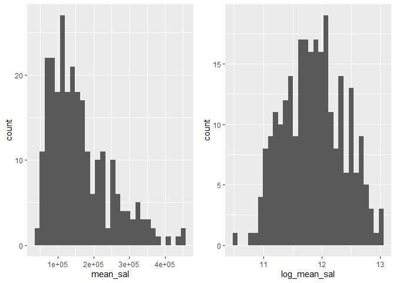
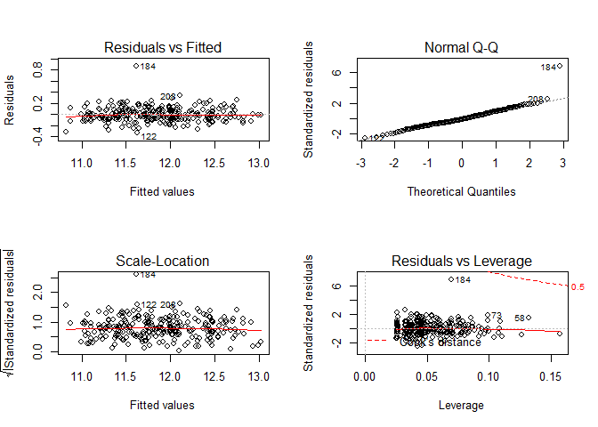
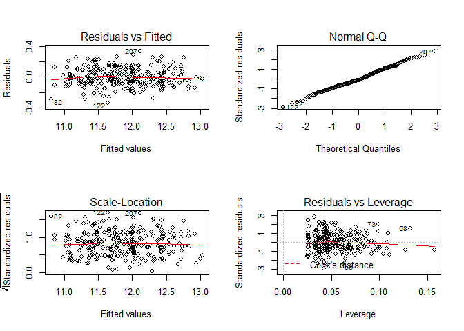

Results\_draft
================
James Ng
12/13/2019

# Methods

The dataset contains 7 factors that are potentially associated with the
salaries of the Houston College of Medicine faculty. These are
department, gender, primary emphasis (clinical or research),
certification (board certified or not certified), publication rate
(publications on CV/ years between CV date and MD date), years since
obtaining MD and rank. The mean salary for the 1994 academic year and
the salary for the 1995 academic year (salary after increment to the
1994 income) are the outcomes. Histograms were were made to visualize
the distribution of the outcomes. The histograms show right skewness so
log transformations of the outcomes were carried out (supplemental -
\#\#\#). Since gender was the main variable of interest, models were
analyzed in R studio (citation - \#\#\#) to test for associations
between gender and salary. A simple linear regression model was
developed using mean salaries for the 2 years provided and gender. Using
this model as the reference point, other variables in the dataset were
analyzed as potential confounders or interactions. Model selection was
made using criterion-based procedures. Once the final model was
determined, residuals vs fitted values plot, quantile-quantile plot,
scale-location plot and residuals vs leverage plots were used to
diagnose the model (supplemental - \#\#\#).

# Results

Several of the other variables (department, primary emphasis,
certification, publication rate and experience) were determined to be
confounders, while rank was found to be an interaction. High
collinearity was found between publication rate and primary emphasis, so
publication rate was dropped from the model. The final model
(supplemental figure \#\#\#) shows that gender is a significant variable
in determining salary. Males on average, earn more than females by
exp(.074) dollars when adjusting for department, primary emphasis,
experience certification, and rank. Associated p values are also
provided. The model shows an adjusted \(R^2\) value of .9322, meaning
that 93% of the variability of the data is represent by the model.
Cook’s distance, quantile-quantile plot, and residuals plots show one
observation (the 184th observation) is an influential point. Influential
points were not dropped from model because this is a model for
association.

|                                   | Females (N=106)                 | Males (N=155)                    | Total (N=261)                   |
| --------------------------------- | :------------------------------ | :------------------------------- | :------------------------------ |
| dept                              |                                 |                                  |                                 |
| \- Biochemistry/Molecular Biology | 20 (18.9%)                      | 30 (19.4%)                       | 50 (19.2%)                      |
| \- Physiology                     | 20 (18.9%)                      | 20 (12.9%)                       | 40 (15.3%)                      |
| \- Genetics                       | 11 (10.4%)                      | 10 (6.5%)                        | 21 (8.0%)                       |
| \- Pediatrics                     | 20 (18.9%)                      | 10 (6.5%)                        | 30 (11.5%)                      |
| \- Medicine                       | 30 (28.3%)                      | 50 (32.3%)                       | 80 (30.7%)                      |
| \- Surgery                        | 5 (4.7%)                        | 35 (22.6%)                       | 40 (15.3%)                      |
| clin                              |                                 |                                  |                                 |
| \- Primarily research emphasis    | 46 (43.4%)                      | 55 (35.5%)                       | 101 (38.7%)                     |
| \- Primarily clinical emphasis    | 60 (56.6%)                      | 100 (64.5%)                      | 160 (61.3%)                     |
| cert                              |                                 |                                  |                                 |
| \- Not Certified                  | 36 (34.0%)                      | 37 (23.9%)                       | 73 (28.0%)                      |
| \- Board Certified                | 70 (66.0%)                      | 118 (76.1%)                      | 188 (72.0%)                     |
| prate                             |                                 |                                  |                                 |
| \- Mean (SD)                      | 5.35 (1.89)                     | 4.65 (1.94)                      | 4.93 (1.94)                     |
| \- Median (Q1, Q3)                | 5.25 (3.73, 7.27)               | 4.00 (3.10, 6.70)                | 4.40 (3.20, 6.90)               |
| exper                             |                                 |                                  |                                 |
| \- Mean (SD)                      | 7.49 (4.17)                     | 12.10 (6.70)                     | 10.23 (6.23)                    |
| \- Median (Q1, Q3)                | 7.00 (5.00, 10.00)              | 10.00 (7.00, 15.00)              | 9.00 (6.00, 14.00)              |
| rank                              |                                 |                                  |                                 |
| \- Assistant                      | 69 (65.1%)                      | 43 (27.7%)                       | 112 (42.9%)                     |
| \- Associate                      | 21 (19.8%)                      | 43 (27.7%)                       | 64 (24.5%)                      |
| \- Full professor                 | 16 (15.1%)                      | 69 (44.5%)                       | 85 (32.6%)                      |
| sal94                             |                                 |                                  |                                 |
| \- Mean (SD)                      | 118871.27 (56168.01)            | 177338.76 (85930.54)             | 153593.34 (80469.67)            |
| \- Median (Q1, Q3)                | 108457.00 (75774.50, 143096.00) | 155006.00 (109687.00, 231501.50) | 133284.00 (90771.00, 200543.00) |
| sal95                             |                                 |                                  |                                 |
| \- Mean (SD)                      | 130876.92 (62034.51)            | 194914.09 (94902.73)             | 168906.66 (88778.43)            |
| \- Median (Q1, Q3)                | 119135.00 (82345.25, 154170.50) | 170967.00 (119952.50, 257163.00) | 148117.00 (99972.00, 218955.00) |

    ## `stat_bin()` using `bins = 30`. Pick better value with `binwidth`.
    ## `stat_bin()` using `bins = 30`. Pick better value with `binwidth`.

<!-- -->

## Final model

``` r
final_model= lm(log_mean_sal ~ dept + clin + cert + exper + gender*rank, data = data)
summary(final_model)
```

    ## 
    ## Call:
    ## lm(formula = log_mean_sal ~ dept + clin + cert + exper + gender * 
    ##     rank, data = data)
    ## 
    ## Residuals:
    ##      Min       1Q   Median       3Q      Max 
    ## -0.32667 -0.08080 -0.01075  0.07646  0.86686 
    ## 
    ## Coefficients:
    ##                                  Estimate Std. Error t value Pr(>|t|)    
    ## (Intercept)                     10.959335   0.027936 392.307  < 2e-16 ***
    ## deptPhysiology                  -0.175544   0.028871  -6.080 4.53e-09 ***
    ## deptGenetics                     0.184572   0.036206   5.098 6.84e-07 ***
    ## deptPediatrics                   0.208468   0.035528   5.868 1.41e-08 ***
    ## deptMedicine                     0.543204   0.029364  18.499  < 2e-16 ***
    ## deptSurgery                      0.931388   0.035267  26.409  < 2e-16 ***
    ## clinPrimarily clinical emphasis  0.197031   0.022175   8.885  < 2e-16 ***
    ## certBoard Certified              0.191213   0.021363   8.951  < 2e-16 ***
    ## exper                            0.018171   0.001806  10.064  < 2e-16 ***
    ## genderMales                      0.074479   0.027568   2.702  0.00738 ** 
    ## rankAssociate                    0.173142   0.033904   5.107 6.55e-07 ***
    ## rankFull professor               0.282281   0.039594   7.129 1.11e-11 ***
    ## genderMales:rankAssociate       -0.082943   0.044750  -1.853  0.06501 .  
    ## genderMales:rankFull professor  -0.105271   0.046654  -2.256  0.02492 *  
    ## ---
    ## Signif. codes:  0 '***' 0.001 '**' 0.01 '*' 0.05 '.' 0.1 ' ' 1
    ## 
    ## Residual standard error: 0.1325 on 247 degrees of freedom
    ## Multiple R-squared:  0.9355, Adjusted R-squared:  0.9322 
    ## F-statistic: 275.8 on 13 and 247 DF,  p-value: < 2.2e-16

``` r
par(mfrow=c(2,2))
plot(final_model)
```

<!-- -->

## Outliers and influ.point

Observation 184 is identified with high DFFITS value so it affects the
observation 184 fitted value. On the diagnostic plot, case 184 appears
problematic on each plot. Therefore, we try to remove this point and do
analysis again.

``` r
remove_184 = data[-c(184),]
remove.mod = lm(log_mean_sal ~ dept + clin + cert + exper + gender*rank, data=remove_184)
summary(remove.mod)
```

    ## 
    ## Call:
    ## lm(formula = log_mean_sal ~ dept + clin + cert + exper + gender * 
    ##     rank, data = remove_184)
    ## 
    ## Residuals:
    ##      Min       1Q   Median       3Q      Max 
    ## -0.33708 -0.07434 -0.01380  0.08434  0.33209 
    ## 
    ## Coefficients:
    ##                                  Estimate Std. Error t value Pr(>|t|)    
    ## (Intercept)                     10.949637   0.025286 433.035  < 2e-16 ***
    ## deptPhysiology                  -0.181193   0.026110  -6.940 3.46e-11 ***
    ## deptGenetics                     0.180068   0.032734   5.501 9.46e-08 ***
    ## deptPediatrics                   0.189702   0.032214   5.889 1.27e-08 ***
    ## deptMedicine                     0.515765   0.026795  19.249  < 2e-16 ***
    ## deptSurgery                      0.915461   0.031951  28.652  < 2e-16 ***
    ## clinPrimarily clinical emphasis  0.218278   0.020244  10.782  < 2e-16 ***
    ## certBoard Certified              0.207168   0.019428  10.663  < 2e-16 ***
    ## exper                            0.018590   0.001633  11.383  < 2e-16 ***
    ## genderMales                      0.045856   0.025211   1.819   0.0701 .  
    ## rankAssociate                    0.167412   0.030658   5.461 1.16e-07 ***
    ## rankFull professor               0.273861   0.035809   7.648 4.60e-13 ***
    ## genderMales:rankAssociate       -0.050384   0.040684  -1.238   0.2167    
    ## genderMales:rankFull professor  -0.077467   0.042336  -1.830   0.0685 .  
    ## ---
    ## Signif. codes:  0 '***' 0.001 '**' 0.01 '*' 0.05 '.' 0.1 ' ' 1
    ## 
    ## Residual standard error: 0.1198 on 246 degrees of freedom
    ## Multiple R-squared:  0.9472, Adjusted R-squared:  0.9445 
    ## F-statistic: 339.8 on 13 and 246 DF,  p-value: < 2.2e-16

``` r
par(mfrow=c(2,2))
plot(remove.mod)
```

<!-- -->

### stratified if needed.

``` r
data_rank_3 = data %>% 
  filter(rank == "Full professor")
data_rank_2 = data %>% 
  filter(rank == "Associate")
data_rank_1 = data %>% 
  filter(rank == "Assistant")

final_model_3 = lm(log_mean_sal ~ dept + clin + cert + exper + gender, data = data_rank_3)
summary(final_model_3)
```

    ## 
    ## Call:
    ## lm(formula = log_mean_sal ~ dept + clin + cert + exper + gender, 
    ##     data = data_rank_3)
    ## 
    ## Residuals:
    ##       Min        1Q    Median        3Q       Max 
    ## -0.279999 -0.079443 -0.000564  0.075727  0.253899 
    ## 
    ## Coefficients:
    ##                                  Estimate Std. Error t value Pr(>|t|)    
    ## (Intercept)                     11.247757   0.048321 232.773  < 2e-16 ***
    ## deptPhysiology                  -0.127860   0.038834  -3.292  0.00152 ** 
    ## deptGenetics                     0.248823   0.055205   4.507 2.38e-05 ***
    ## deptPediatrics                   0.166793   0.066371   2.513  0.01412 *  
    ## deptMedicine                     0.528191   0.039209  13.471  < 2e-16 ***
    ## deptSurgery                      0.948635   0.050331  18.848  < 2e-16 ***
    ## clinPrimarily clinical emphasis  0.179305   0.033412   5.367 8.61e-07 ***
    ## certBoard Certified              0.258010   0.033989   7.591 7.14e-11 ***
    ## exper                            0.014871   0.002253   6.601 5.15e-09 ***
    ## genderMales                     -0.040413   0.036217  -1.116  0.26805    
    ## ---
    ## Signif. codes:  0 '***' 0.001 '**' 0.01 '*' 0.05 '.' 0.1 ' ' 1
    ## 
    ## Residual standard error: 0.1165 on 75 degrees of freedom
    ## Multiple R-squared:  0.9511, Adjusted R-squared:  0.9452 
    ## F-statistic: 161.9 on 9 and 75 DF,  p-value: < 2.2e-16

``` r
final_model_2 = lm(log_mean_sal ~ dept + clin + cert + exper + gender, data = data_rank_2)
summary(final_model_2)
```

    ## 
    ## Call:
    ## lm(formula = log_mean_sal ~ dept + clin + cert + exper + gender, 
    ##     data = data_rank_2)
    ## 
    ## Residuals:
    ##       Min        1Q    Median        3Q       Max 
    ## -0.268895 -0.061719  0.008443  0.069568  0.186993 
    ## 
    ## Coefficients:
    ##                                  Estimate Std. Error t value Pr(>|t|)    
    ## (Intercept)                     11.093068   0.045411 244.283  < 2e-16 ***
    ## deptPhysiology                  -0.189342   0.043481  -4.355 5.99e-05 ***
    ## deptGenetics                     0.170588   0.055740   3.060 0.003439 ** 
    ## deptPediatrics                   0.210069   0.055921   3.757 0.000424 ***
    ## deptMedicine                     0.507098   0.050051  10.132 4.30e-14 ***
    ## deptSurgery                      0.931900   0.057099  16.321  < 2e-16 ***
    ## clinPrimarily clinical emphasis  0.220247   0.037705   5.841 3.06e-07 ***
    ## certBoard Certified              0.200488   0.031803   6.304 5.53e-08 ***
    ## exper                            0.021512   0.002619   8.214 4.45e-11 ***
    ## genderMales                     -0.013277   0.031011  -0.428 0.670252    
    ## ---
    ## Signif. codes:  0 '***' 0.001 '**' 0.01 '*' 0.05 '.' 0.1 ' ' 1
    ## 
    ## Residual standard error: 0.1033 on 54 degrees of freedom
    ## Multiple R-squared:  0.9621, Adjusted R-squared:  0.9558 
    ## F-statistic: 152.2 on 9 and 54 DF,  p-value: < 2.2e-16

``` r
final_model_1= lm(log_mean_sal ~ dept + clin + cert + exper + gender, data = data_rank_1)
summary(final_model_1)
```

    ## 
    ## Call:
    ## lm(formula = log_mean_sal ~ dept + clin + cert + exper + gender, 
    ##     data = data_rank_1)
    ## 
    ## Residuals:
    ##      Min       1Q   Median       3Q      Max 
    ## -0.30995 -0.09230 -0.01370  0.07692  0.78854 
    ## 
    ## Coefficients:
    ##                                  Estimate Std. Error t value Pr(>|t|)    
    ## (Intercept)                     10.958748   0.058460 187.457  < 2e-16 ***
    ## deptPhysiology                  -0.201314   0.063379  -3.176 0.001973 ** 
    ## deptGenetics                     0.143432   0.069186   2.073 0.040681 *  
    ## deptPediatrics                   0.255421   0.066715   3.829 0.000223 ***
    ## deptMedicine                     0.600806   0.061033   9.844  < 2e-16 ***
    ## deptSurgery                      0.943082   0.070044  13.464  < 2e-16 ***
    ## clinPrimarily clinical emphasis  0.179071   0.042166   4.247 4.80e-05 ***
    ## certBoard Certified              0.119828   0.040890   2.931 0.004176 ** 
    ## exper                            0.024735   0.005354   4.620 1.12e-05 ***
    ## genderMales                      0.082656   0.035347   2.338 0.021316 *  
    ## ---
    ## Signif. codes:  0 '***' 0.001 '**' 0.01 '*' 0.05 '.' 0.1 ' ' 1
    ## 
    ## Residual standard error: 0.1541 on 102 degrees of freedom
    ## Multiple R-squared:  0.9126, Adjusted R-squared:  0.9049 
    ## F-statistic: 118.3 on 9 and 102 DF,  p-value: < 2.2e-16
