ziqi\_draft
================
Ziqi Zhou
12/7/2019

## Read and clean the data

``` r
data = read_csv("./data/Lawsuit.csv") %>% 
  janitor::clean_names() %>% 
  mutate(dept = as.factor(dept),
         gender = as.factor(gender),
         clin = as.factor(clin),
         cert = as.factor(cert),
         rank = as.factor(rank)) 
```

    ## Parsed with column specification:
    ## cols(
    ##   ID = col_double(),
    ##   Dept = col_double(),
    ##   Gender = col_double(),
    ##   Clin = col_double(),
    ##   Cert = col_double(),
    ##   Prate = col_double(),
    ##   Exper = col_double(),
    ##   Rank = col_double(),
    ##   Sal94 = col_double(),
    ##   Sal95 = col_double()
    ## )

``` r
sum(is.na(data))
```

    ## [1] 0

There is no missing value in this dataset. **waiting for recode after
analysis**

``` r
class(data$dept)
```

    ## [1] "factor"

``` r
tab1 = tableby(gender ~ dept + clin + cert + prate + exper + rank + sal94 + sal95,
               data = data,
               total = TRUE,
               control = my_controls
               )

summary(tab1, title = "Descriptive Statistics", text=T) %>% 
  knitr::kable()
```

|                    | 0 (N=106)                       | 1 (N=155)                        | Total (N=261)                   |
| ------------------ | :------------------------------ | :------------------------------- | :------------------------------ |
| dept               |                                 |                                  |                                 |
| \- 1               | 20 (18.9%)                      | 30 (19.4%)                       | 50 (19.2%)                      |
| \- 2               | 20 (18.9%)                      | 20 (12.9%)                       | 40 (15.3%)                      |
| \- 3               | 11 (10.4%)                      | 10 (6.5%)                        | 21 (8.0%)                       |
| \- 4               | 20 (18.9%)                      | 10 (6.5%)                        | 30 (11.5%)                      |
| \- 5               | 30 (28.3%)                      | 50 (32.3%)                       | 80 (30.7%)                      |
| \- 6               | 5 (4.7%)                        | 35 (22.6%)                       | 40 (15.3%)                      |
| clin               |                                 |                                  |                                 |
| \- 0               | 46 (43.4%)                      | 55 (35.5%)                       | 101 (38.7%)                     |
| \- 1               | 60 (56.6%)                      | 100 (64.5%)                      | 160 (61.3%)                     |
| cert               |                                 |                                  |                                 |
| \- 0               | 36 (34.0%)                      | 37 (23.9%)                       | 73 (28.0%)                      |
| \- 1               | 70 (66.0%)                      | 118 (76.1%)                      | 188 (72.0%)                     |
| prate              |                                 |                                  |                                 |
| \- Mean (SD)       | 5.35 (1.89)                     | 4.65 (1.94)                      | 4.93 (1.94)                     |
| \- Median (Q1, Q3) | 5.25 (3.73, 7.27)               | 4.00 (3.10, 6.70)                | 4.40 (3.20, 6.90)               |
| exper              |                                 |                                  |                                 |
| \- Mean (SD)       | 7.49 (4.17)                     | 12.10 (6.70)                     | 10.23 (6.23)                    |
| \- Median (Q1, Q3) | 7.00 (5.00, 10.00)              | 10.00 (7.00, 15.00)              | 9.00 (6.00, 14.00)              |
| rank               |                                 |                                  |                                 |
| \- 1               | 69 (65.1%)                      | 43 (27.7%)                       | 112 (42.9%)                     |
| \- 2               | 21 (19.8%)                      | 43 (27.7%)                       | 64 (24.5%)                      |
| \- 3               | 16 (15.1%)                      | 69 (44.5%)                       | 85 (32.6%)                      |
| sal94              |                                 |                                  |                                 |
| \- Mean (SD)       | 118871.27 (56168.01)            | 177338.76 (85930.54)             | 153593.34 (80469.67)            |
| \- Median (Q1, Q3) | 108457.00 (75774.50, 143096.00) | 155006.00 (109687.00, 231501.50) | 133284.00 (90771.00, 200543.00) |
| sal95              |                                 |                                  |                                 |
| \- Mean (SD)       | 130876.92 (62034.51)            | 194914.09 (94902.73)             | 168906.66 (88778.43)            |
| \- Median (Q1, Q3) | 119135.00 (82345.25, 154170.50) | 170967.00 (119952.50, 257163.00) | 148117.00 (99972.00, 218955.00) |

## Exploratory about the distribution of outcome

``` r
data %>% 
  ggplot(aes(x = sal94)) + 
  geom_histogram()
```

    ## `stat_bin()` using `bins = 30`. Pick better value with `binwidth`.

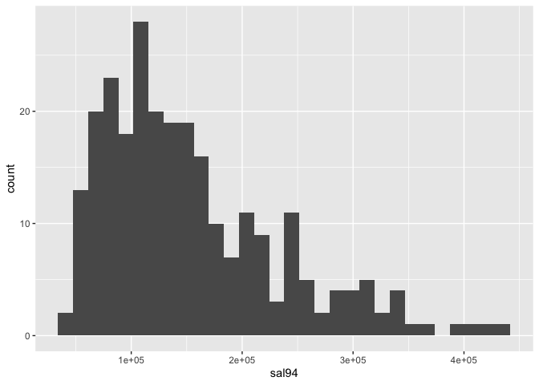<!-- -->

``` r
data %>% 
  ggplot(aes(x = log(sal94))) + 
  geom_histogram()
```

    ## `stat_bin()` using `bins = 30`. Pick better value with `binwidth`.

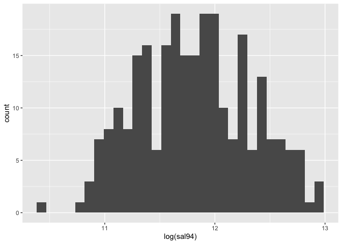<!-- -->

``` r
data %>% 
  ggplot(aes(x = sal95)) + 
  geom_histogram()
```

    ## `stat_bin()` using `bins = 30`. Pick better value with `binwidth`.

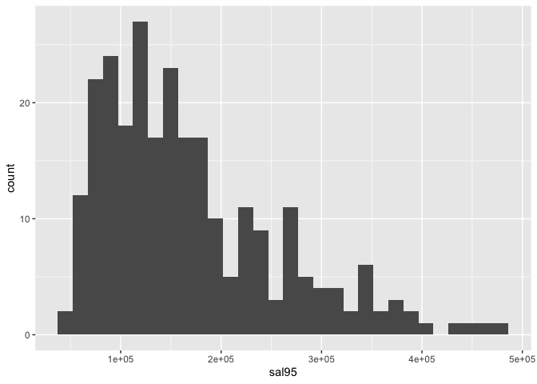<!-- -->

``` r
data %>% 
  ggplot(aes(x = log(sal95))) + 
  geom_histogram()
```

    ## `stat_bin()` using `bins = 30`. Pick better value with `binwidth`.

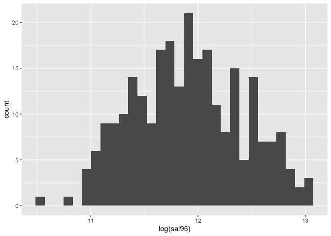<!-- -->

``` r
data = data %>% 
  mutate(log_sal94 = log(sal94),
         log_sal95 = log(sal95))
```

We could see that the sal94 and sal 95 are obviously right skewed, so we
choose log transformation.

## fit the model

``` r
data94 = data %>% 
  dplyr::select(-sal94, -sal95, -log_sal95,-id) %>% 
  dplyr::select(log_sal94, everything())

data95 = data %>% 
  dplyr::select(-sal94, -sal95, -log_sal94,-id) %>% 
  dplyr::select(log_sal95, everything())


pairs(data94)
```

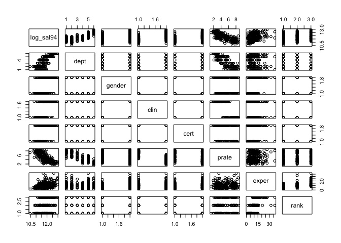<!-- -->

``` r
pairs(data95)
```

<!-- --> We use
the stepwise regression.

``` r
mult.fit <- lm(log_sal94 ~ . , data=data94)
step(mult.fit, direction='backward')
```

    ## Start:  AIC=-1037.13
    ## log_sal94 ~ dept + gender + clin + cert + prate + exper + rank
    ## 
    ##          Df Sum of Sq     RSS      AIC
    ## - gender  1    0.0190  4.4615 -1038.02
    ## - prate   1    0.0288  4.4713 -1037.45
    ## <none>                 4.4425 -1037.13
    ## - clin    1    0.2719  4.7143 -1023.63
    ## - rank    2    1.2528  5.6952  -976.30
    ## - cert    1    1.4736  5.9161  -964.37
    ## - exper   1    1.7301  6.1726  -953.29
    ## - dept    5    9.2120 13.6544  -754.07
    ## 
    ## Step:  AIC=-1038.02
    ## log_sal94 ~ dept + clin + cert + prate + exper + rank
    ## 
    ##         Df Sum of Sq     RSS      AIC
    ## <none>                4.4615 -1038.02
    ## - prate  1    0.0441  4.5056 -1037.45
    ## - clin   1    0.2537  4.7152 -1025.58
    ## - rank   2    1.3891  5.8506  -971.27
    ## - cert   1    1.4895  5.9510  -964.83
    ## - exper  1    1.8398  6.3013  -949.90
    ## - dept   5    9.4082 13.8697  -751.99

    ## 
    ## Call:
    ## lm(formula = log_sal94 ~ dept + clin + cert + prate + exper + 
    ##     rank, data = data94)
    ## 
    ## Coefficients:
    ## (Intercept)        dept2        dept3        dept4        dept5  
    ##    11.13433     -0.17743      0.16608      0.13592      0.48950  
    ##       dept6        clin1        cert1        prate        exper  
    ##     0.86148      0.15175      0.19394     -0.02649      0.01829  
    ##       rank2        rank3  
    ##     0.13551      0.22428

``` r
step(mult.fit, direction = 'both') 
```

    ## Start:  AIC=-1037.13
    ## log_sal94 ~ dept + gender + clin + cert + prate + exper + rank
    ## 
    ##          Df Sum of Sq     RSS      AIC
    ## - gender  1    0.0190  4.4615 -1038.02
    ## - prate   1    0.0288  4.4713 -1037.45
    ## <none>                 4.4425 -1037.13
    ## - clin    1    0.2719  4.7143 -1023.63
    ## - rank    2    1.2528  5.6952  -976.30
    ## - cert    1    1.4736  5.9161  -964.37
    ## - exper   1    1.7301  6.1726  -953.29
    ## - dept    5    9.2120 13.6544  -754.07
    ## 
    ## Step:  AIC=-1038.02
    ## log_sal94 ~ dept + clin + cert + prate + exper + rank
    ## 
    ##          Df Sum of Sq     RSS      AIC
    ## <none>                 4.4615 -1038.02
    ## - prate   1    0.0441  4.5056 -1037.45
    ## + gender  1    0.0190  4.4425 -1037.13
    ## - clin    1    0.2537  4.7152 -1025.58
    ## - rank    2    1.3891  5.8506  -971.27
    ## - cert    1    1.4895  5.9510  -964.83
    ## - exper   1    1.8398  6.3013  -949.90
    ## - dept    5    9.4082 13.8697  -751.99

    ## 
    ## Call:
    ## lm(formula = log_sal94 ~ dept + clin + cert + prate + exper + 
    ##     rank, data = data94)
    ## 
    ## Coefficients:
    ## (Intercept)        dept2        dept3        dept4        dept5  
    ##    11.13433     -0.17743      0.16608      0.13592      0.48950  
    ##       dept6        clin1        cert1        prate        exper  
    ##     0.86148      0.15175      0.19394     -0.02649      0.01829  
    ##       rank2        rank3  
    ##     0.13551      0.22428

``` r
model94 = lm(log_sal94 ~ dept + clin + cert + exper + rank + prate,data = data94)
summary(model94)
```

    ## 
    ## Call:
    ## lm(formula = log_sal94 ~ dept + clin + cert + exper + rank + 
    ##     prate, data = data94)
    ## 
    ## Residuals:
    ##      Min       1Q   Median       3Q      Max 
    ## -0.35367 -0.08193 -0.01482  0.08201  0.90388 
    ## 
    ## Coefficients:
    ##              Estimate Std. Error t value Pr(>|t|)    
    ## (Intercept) 11.134329   0.130017  85.638  < 2e-16 ***
    ## dept2       -0.177429   0.029134  -6.090 4.25e-09 ***
    ## dept3        0.166082   0.038676   4.294 2.51e-05 ***
    ## dept4        0.135920   0.052358   2.596 0.009993 ** 
    ## dept5        0.489498   0.044962  10.887  < 2e-16 ***
    ## dept6        0.861483   0.061503  14.007  < 2e-16 ***
    ## clin1        0.151748   0.040326   3.763 0.000209 ***
    ## cert1        0.193940   0.021271   9.118  < 2e-16 ***
    ## exper        0.018293   0.001805  10.133  < 2e-16 ***
    ## rank2        0.135514   0.023251   5.828 1.73e-08 ***
    ## rank3        0.224279   0.025783   8.699 4.65e-16 ***
    ## prate       -0.026486   0.016873  -1.570 0.117748    
    ## ---
    ## Signif. codes:  0 '***' 0.001 '**' 0.01 '*' 0.05 '.' 0.1 ' ' 1
    ## 
    ## Residual standard error: 0.1339 on 249 degrees of freedom
    ## Multiple R-squared:  0.9336, Adjusted R-squared:  0.9306 
    ## F-statistic: 318.1 on 11 and 249 DF,  p-value: < 2.2e-16

``` r
anova(model94)
```

    ## Analysis of Variance Table
    ## 
    ## Response: log_sal94
    ##            Df Sum Sq Mean Sq F value Pr(>F)    
    ## dept        5 48.472  9.6943 541.049 <2e-16 ***
    ## clin        1  2.369  2.3691 132.221 <2e-16 ***
    ## cert        1  2.880  2.8803 160.752 <2e-16 ***
    ## exper       1  7.434  7.4343 414.913 <2e-16 ***
    ## rank        2  1.500  0.7501  41.862 <2e-16 ***
    ## prate       1  0.044  0.0441   2.464 0.1177    
    ## Residuals 249  4.461  0.0179                   
    ## ---
    ## Signif. codes:  0 '***' 0.001 '**' 0.01 '*' 0.05 '.' 0.1 ' ' 1

``` r
plot(model94)
```

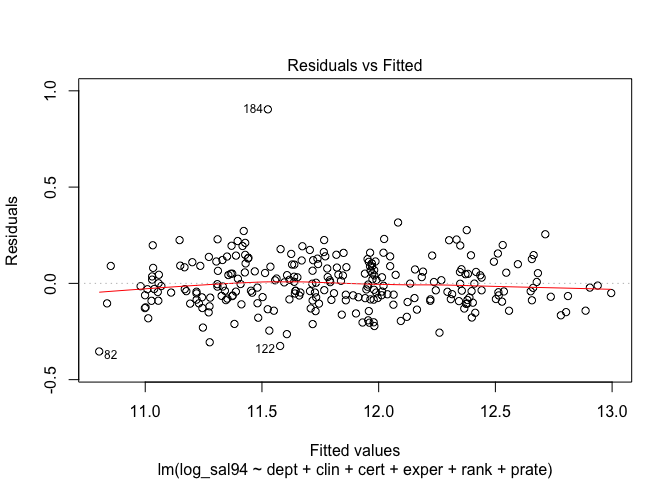<!-- --><!-- -->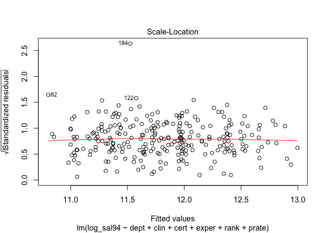<!-- -->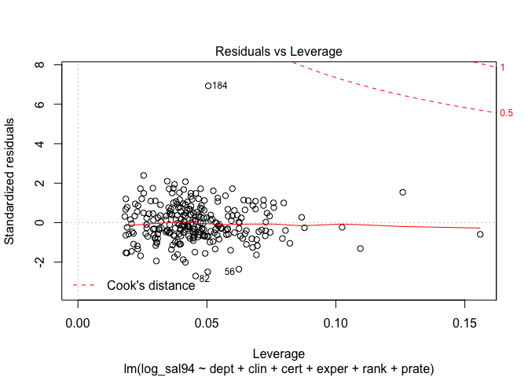<!-- -->

``` r
influ.point94 <- influence.measures(model94)
summary(influ.point94) %>% knitr::kable()
```

    ## Potentially influential observations of
    ##   lm(formula = log_sal94 ~ dept + clin + cert + exper + rank +      prate, data = data94) :
    ## 
    ##     dfb.1_ dfb.dpt2 dfb.dpt3 dfb.dpt4 dfb.dpt5 dfb.dpt6 dfb.cln1 dfb.crt1
    ## 19   0.03   0.03     0.02    -0.02    -0.01    -0.01    -0.02     0.07   
    ## 56  -0.27  -0.30     0.04     0.22     0.20     0.22     0.33    -0.24   
    ## 82  -0.18  -0.35     0.04     0.06     0.05     0.05     0.19     0.20   
    ## 91   0.00  -0.01    -0.06    -0.01    -0.01     0.00     0.02    -0.02   
    ## 109 -0.02   0.00     0.06     0.01     0.02     0.02     0.00     0.03   
    ## 111  0.05   0.00    -0.06    -0.04    -0.04    -0.05    -0.03     0.01   
    ## 122  0.26   0.03    -0.05    -0.38    -0.16    -0.19    -0.29    -0.01   
    ## 184  0.59   0.19    -0.01     0.00     0.36     0.02    -0.88    -0.79   
    ## 208 -0.10   0.00     0.02     0.05     0.14     0.05     0.11     0.03   
    ##     dfb.expr dfb.rnk2 dfb.rnk3 dfb.prat dffit   cov.r   cook.d hat    
    ## 19  -0.22     0.03     0.14    -0.03    -0.25    1.22_*  0.01   0.16_*
    ## 56   0.05    -0.21     0.04     0.29    -0.61    0.85_*  0.03   0.06  
    ## 82   0.08     0.17     0.11     0.14    -0.60    0.77_*  0.03   0.05  
    ## 91  -0.03     0.01     0.00     0.01    -0.08    1.15_*  0.00   0.09  
    ## 109  0.00     0.03     0.00     0.02     0.08    1.15_*  0.00   0.09  
    ## 111  0.00     0.01     0.00    -0.05    -0.08    1.17_*  0.00   0.10  
    ## 122  0.06     0.08     0.02    -0.28    -0.58    0.82_*  0.03   0.05  
    ## 184 -0.21    -0.41    -0.15    -0.44     1.78_*  0.08_*  0.21   0.05  
    ## 208  0.18    -0.17    -0.21     0.10     0.39    0.81_*  0.01   0.03

|     |     dfb.1\_ |    dfb.dpt2 |    dfb.dpt3 |    dfb.dpt4 |    dfb.dpt5 |    dfb.dpt6 |    dfb.cln1 |    dfb.crt1 |    dfb.expr |    dfb.rnk2 |    dfb.rnk3 |    dfb.prat |       dffit |     cov.r |    cook.d |       hat |
| --- | ----------: | ----------: | ----------: | ----------: | ----------: | ----------: | ----------: | ----------: | ----------: | ----------: | ----------: | ----------: | ----------: | --------: | --------: | --------: |
| 19  |   0.0328821 |   0.0310786 |   0.0209385 | \-0.0198813 | \-0.0080619 | \-0.0114367 | \-0.0217519 |   0.0735959 | \-0.2172144 |   0.0347784 |   0.1385169 | \-0.0289485 | \-0.2531210 | 1.2227541 | 0.0053532 | 0.1559804 |
| 56  | \-0.2661684 | \-0.3022080 |   0.0419318 |   0.2247184 |   0.1974272 |   0.2224185 |   0.3278731 | \-0.2384721 |   0.0490124 | \-0.2091711 |   0.0376576 |   0.2873566 | \-0.6144900 | 0.8533350 | 0.0308870 | 0.0624201 |
| 82  | \-0.1837973 | \-0.3463907 |   0.0443548 |   0.0571780 |   0.0480798 |   0.0520756 |   0.1900236 |   0.1960935 |   0.0784881 |   0.1659343 |   0.1094214 |   0.1364230 | \-0.5991065 | 0.7688967 | 0.0291491 | 0.0456373 |
| 91  |   0.0006248 | \-0.0080893 | \-0.0558961 | \-0.0052632 | \-0.0060981 | \-0.0029034 |   0.0206717 | \-0.0213723 | \-0.0315225 |   0.0118756 |   0.0043748 |   0.0051197 | \-0.0808993 | 1.1467598 | 0.0005474 | 0.0878389 |
| 109 | \-0.0216725 |   0.0036194 |   0.0625826 |   0.0143018 |   0.0194284 |   0.0193230 |   0.0003869 |   0.0339819 | \-0.0043215 |   0.0300466 |   0.0018048 |   0.0189701 |   0.0830653 | 1.1451336 | 0.0005771 | 0.0867501 |
| 111 |   0.0452398 | \-0.0034801 | \-0.0610366 | \-0.0420773 | \-0.0448841 | \-0.0478912 | \-0.0296523 |   0.0126083 |   0.0039720 |   0.0088060 |   0.0041662 | \-0.0492680 | \-0.0799636 | 1.1660795 | 0.0005349 | 0.1024336 |
| 122 |   0.2609946 |   0.0327925 | \-0.0546636 | \-0.3821496 | \-0.1602783 | \-0.1884837 | \-0.2924855 | \-0.0050220 |   0.0558079 |   0.0785900 |   0.0214355 | \-0.2800033 | \-0.5799901 | 0.8159831 | 0.0274430 | 0.0503258 |
| 184 |   0.5864716 |   0.1906714 | \-0.0074227 |   0.0043074 |   0.3558627 |   0.0201052 | \-0.8775032 | \-0.7949996 | \-0.2112844 | \-0.4130221 | \-0.1480613 | \-0.4418875 |   1.7763819 | 0.0844895 | 0.2130987 | 0.0505546 |
| 208 | \-0.1037563 |   0.0001771 |   0.0232710 |   0.0510155 |   0.1355613 |   0.0510857 |   0.1140617 |   0.0316973 |   0.1761639 | \-0.1670993 | \-0.2133071 |   0.0985351 |   0.3905838 | 0.8146800 | 0.0124708 | 0.0254796 |

``` r
model94_1 = lm(log_sal94 ~ dept + clin + cert + exper + rank +  gender + prate,data = data94) 
anova(model94_1)
```

    ## Analysis of Variance Table
    ## 
    ## Response: log_sal94
    ##            Df Sum Sq Mean Sq  F value Pr(>F)    
    ## dept        5 48.472  9.6943 541.1836 <2e-16 ***
    ## clin        1  2.369  2.3691 132.2542 <2e-16 ***
    ## cert        1  2.880  2.8803 160.7918 <2e-16 ***
    ## exper       1  7.434  7.4343 415.0163 <2e-16 ***
    ## rank        2  1.500  0.7501  41.8729 <2e-16 ***
    ## gender      1  0.034  0.0344   1.9185 0.1673    
    ## prate       1  0.029  0.0288   1.6079 0.2060    
    ## Residuals 248  4.442  0.0179                    
    ## ---
    ## Signif. codes:  0 '***' 0.001 '**' 0.01 '*' 0.05 '.' 0.1 ' ' 1

``` r
plot(model94_1)
```

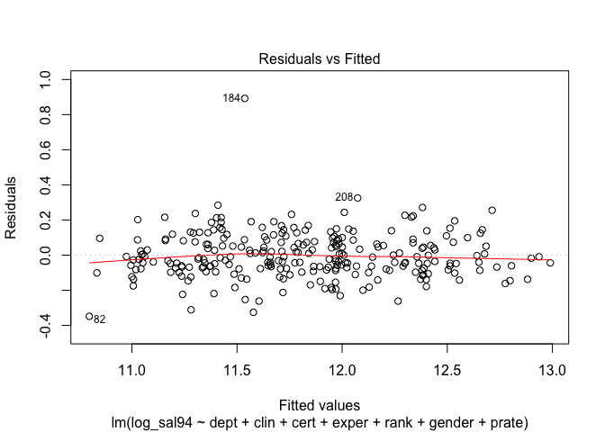<!-- -->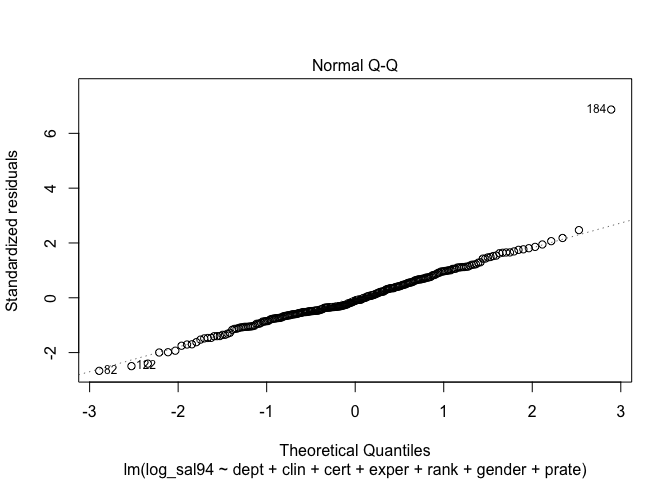<!-- -->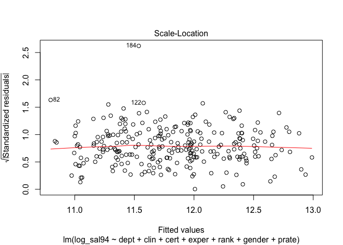<!-- -->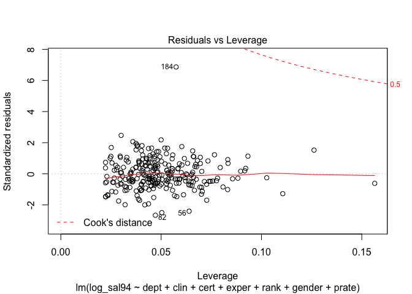<!-- -->

``` r
multi.fit95 = lm(log_sal95 ~ . , data=data95)
step(multi.fit95, direction = 'both')
```

    ## Start:  AIC=-1037.02
    ## log_sal95 ~ dept + gender + clin + cert + prate + exper + rank
    ## 
    ##          Df Sum of Sq     RSS      AIC
    ## - gender  1    0.0146  4.4591 -1038.16
    ## - prate   1    0.0271  4.4716 -1037.43
    ## <none>                 4.4445 -1037.02
    ## - clin    1    0.2988  4.7433 -1022.03
    ## - rank    2    1.2755  5.7200  -975.16
    ## - cert    1    1.4102  5.8547  -967.09
    ## - exper   1    1.7458  6.1903  -952.54
    ## - dept    5    9.1351 13.5795  -755.50
    ## 
    ## Step:  AIC=-1038.16
    ## log_sal95 ~ dept + clin + cert + prate + exper + rank
    ## 
    ##          Df Sum of Sq     RSS      AIC
    ## <none>                 4.4591 -1038.16
    ## - prate   1    0.0403  4.4994 -1037.81
    ## + gender  1    0.0146  4.4445 -1037.02
    ## - clin    1    0.2842  4.7434 -1024.03
    ## - rank    2    1.4050  5.8641  -970.67
    ## - cert    1    1.4240  5.8831  -967.83
    ## - exper   1    1.8485  6.3076  -949.64
    ## - dept    5    9.3142 13.7733  -753.81

    ## 
    ## Call:
    ## lm(formula = log_sal95 ~ dept + clin + cert + prate + exper + 
    ##     rank, data = data95)
    ## 
    ## Coefficients:
    ## (Intercept)        dept2        dept3        dept4        dept5  
    ##    11.21627     -0.17603      0.16504      0.14657      0.49103  
    ##       dept6        clin1        cert1        prate        exper  
    ##     0.86840      0.16062      0.18963     -0.02529      0.01834  
    ##       rank2        rank3  
    ##     0.13774      0.22521

``` r
model95 = lm(log_sal95 ~  dept + gender + clin + cert + exper + 
    rank, data = data95) 
tidy(model95)
```

    ## # A tibble: 12 x 5
    ##    term        estimate std.error statistic  p.value
    ##    <chr>          <dbl>     <dbl>     <dbl>    <dbl>
    ##  1 (Intercept)  11.0      0.0275     401.   0.      
    ##  2 dept2        -0.175    0.0292      -6.00 6.89e- 9
    ##  3 dept3         0.185    0.0366       5.06 8.29e- 7
    ##  4 dept4         0.207    0.0358       5.78 2.20e- 8
    ##  5 dept5         0.539    0.0296      18.2  1.03e-47
    ##  6 dept6         0.936    0.0356      26.3  9.45e-74
    ##  7 gender1       0.0244   0.0197       1.24 2.15e- 1
    ##  8 clin1         0.211    0.0219       9.64 6.93e-19
    ##  9 cert1         0.188    0.0213       8.82 2.07e-16
    ## 10 exper         0.0178   0.00182      9.78 2.46e-19
    ## 11 rank2         0.136    0.0236       5.76 2.49e- 8
    ## 12 rank3         0.223    0.0263       8.47 2.10e-15

``` r
anova(model95)
```

    ## Analysis of Variance Table
    ## 
    ## Response: log_sal95
    ##            Df Sum Sq Mean Sq F value    Pr(>F)    
    ## dept        5 48.737  9.7473 542.775 < 2.2e-16 ***
    ## gender      1  2.381  2.3814 132.609 < 2.2e-16 ***
    ## clin        1  2.431  2.4306 135.349 < 2.2e-16 ***
    ## cert        1  2.421  2.4205 134.786 < 2.2e-16 ***
    ## exper       1  5.742  5.7418 319.732 < 2.2e-16 ***
    ## rank        2  1.319  0.6597  36.735 1.047e-14 ***
    ## Residuals 249  4.472  0.0180                      
    ## ---
    ## Signif. codes:  0 '***' 0.001 '**' 0.01 '*' 0.05 '.' 0.1 ' ' 1

``` r
plot(model95)
```

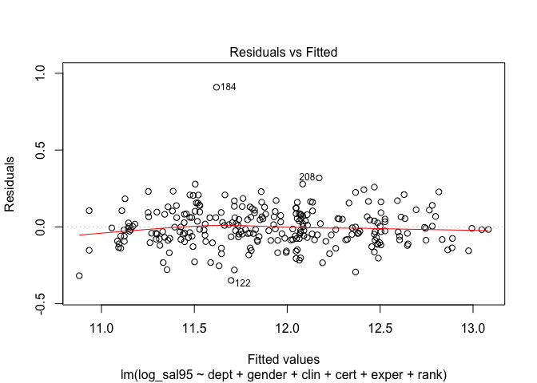<!-- -->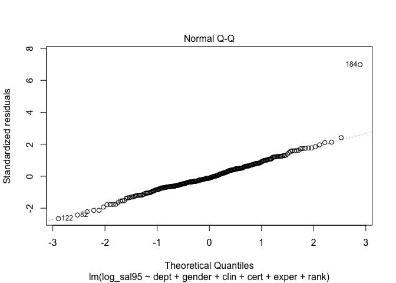<!-- -->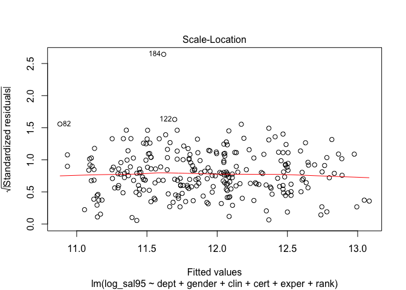<!-- -->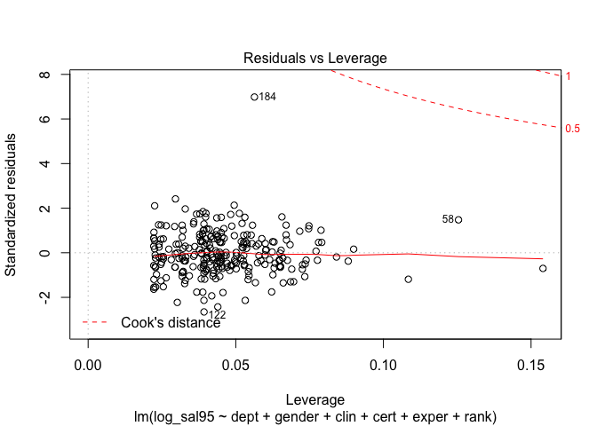<!-- -->

``` r
vif(model95)
```

    ##    dept2    dept3    dept4    dept5    dept6  gender1    clin1    cert1 
    ## 1.607121 1.439383 1.894530 2.704003 2.392543 1.356319 1.659126 1.327650 
    ##    exper    rank2    rank3 
    ## 1.852094 1.499835 2.209568

``` r
influ.point95 <- influence.measures(model95)
summary(influ.point95) %>% knitr::kable()
```

    ## Potentially influential observations of
    ##   lm(formula = log_sal95 ~ dept + gender + clin + cert + exper +      rank, data = data95) :
    ## 
    ##     dfb.1_ dfb.dpt2 dfb.dpt3 dfb.dpt4 dfb.dpt5 dfb.dpt6 dfb.gnd1 dfb.cln1
    ## 19   0.03   0.04     0.04     0.00     0.03     0.03    -0.01     0.01   
    ## 82  -0.22  -0.30     0.00    -0.05    -0.08    -0.11     0.06     0.12   
    ## 109 -0.01   0.00     0.04     0.00     0.01     0.01    -0.01    -0.02   
    ## 122 -0.08   0.03     0.04    -0.27     0.08     0.06     0.07    -0.11   
    ## 174  0.14   0.00     0.00     0.03    -0.09     0.06    -0.07    -0.07   
    ## 184  0.63   0.22     0.16     0.54     1.00_*   0.53     0.75    -0.94   
    ## 208 -0.01  -0.01    -0.01    -0.04     0.11    -0.02    -0.19     0.06   
    ##     dfb.crt1 dfb.expr dfb.rnk2 dfb.rnk3 dffit   cov.r   cook.d hat    
    ## 19   0.09    -0.26     0.05     0.17    -0.30    1.21_*  0.01   0.15_*
    ## 82   0.18     0.07     0.12     0.06    -0.53    0.82_*  0.02   0.04  
    ## 109  0.02     0.00     0.02     0.00     0.05    1.15_*  0.00   0.09  
    ## 122 -0.02     0.02     0.10     0.05    -0.54    0.77_*  0.02   0.04  
    ## 174 -0.07    -0.07    -0.18     0.06    -0.40    0.85_*  0.01   0.03  
    ## 184 -0.84    -0.36    -0.51    -0.26     1.90_*  0.08_*  0.24   0.06  
    ## 208  0.04     0.21    -0.14    -0.18     0.43    0.81_*  0.01   0.03

|     |     dfb.1\_ |    dfb.dpt2 |    dfb.dpt3 |    dfb.dpt4 |    dfb.dpt5 |    dfb.dpt6 |    dfb.gnd1 |    dfb.cln1 |    dfb.crt1 |    dfb.expr |    dfb.rnk2 |    dfb.rnk3 |       dffit |     cov.r |    cook.d |       hat |
| --- | ----------: | ----------: | ----------: | ----------: | ----------: | ----------: | ----------: | ----------: | ----------: | ----------: | ----------: | ----------: | ----------: | --------: | --------: | --------: |
| 19  |   0.0269104 |   0.0360065 |   0.0381332 |   0.0017711 |   0.0255688 |   0.0269040 | \-0.0075568 |   0.0055638 |   0.0866092 | \-0.2591976 |   0.0465602 |   0.1682787 | \-0.2990590 | 1.2114625 | 0.0074683 | 0.1540385 |
| 82  | \-0.2231449 | \-0.3043837 |   0.0009676 | \-0.0515670 | \-0.0797680 | \-0.1051722 |   0.0639693 |   0.1242854 |   0.1772467 |   0.0725565 |   0.1178693 |   0.0631856 | \-0.5251576 | 0.8238128 | 0.0225298 | 0.0439226 |
| 109 | \-0.0065401 |   0.0016948 |   0.0351664 | \-0.0006184 |   0.0057688 |   0.0066105 | \-0.0147144 | \-0.0170380 |   0.0210334 |   0.0005308 |   0.0192918 |   0.0029850 |   0.0502938 | 1.1517435 | 0.0002116 | 0.0899227 |
| 122 | \-0.0753321 |   0.0328023 |   0.0431501 | \-0.2704414 |   0.0771609 |   0.0636438 |   0.0700045 | \-0.1118924 | \-0.0172120 |   0.0211402 |   0.1040224 |   0.0477184 | \-0.5430306 | 0.7741759 | 0.0239748 | 0.0392487 |
| 174 |   0.1381951 |   0.0001089 | \-0.0007720 |   0.0306671 | \-0.0903893 |   0.0576509 | \-0.0701857 | \-0.0680040 | \-0.0672228 | \-0.0691977 | \-0.1812007 |   0.0602425 | \-0.3959901 | 0.8502013 | 0.0128589 | 0.0301974 |
| 184 |   0.6252095 |   0.2185712 |   0.1630793 |   0.5364623 |   1.0035154 |   0.5285472 |   0.7549406 | \-0.9425989 | \-0.8432263 | \-0.3589515 | \-0.5145683 | \-0.2649298 |   1.8991935 | 0.0812275 | 0.2426615 | 0.0563265 |
| 208 | \-0.0067702 | \-0.0063573 | \-0.0135738 | \-0.0437526 |   0.1087986 | \-0.0169271 | \-0.1871305 |   0.0579556 |   0.0411076 |   0.2124807 | \-0.1399512 | \-0.1809242 |   0.4257288 | 0.8137569 | 0.0148095 | 0.0295714 |
